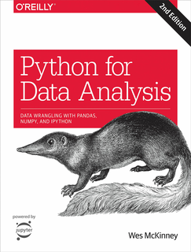
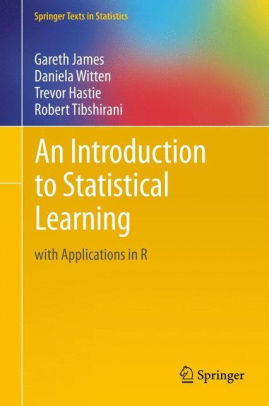
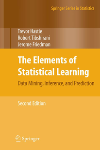

# Repositorio de Minería de Datos Agosto - Diciembre 2020

M. Sc. Liliana Millán Núñez, liliana.millan@itam.mx

Lunes y Miércoles 16 - 17:30

### Objetivos del curso

+ Que el alumno sea capaz de saber distinguir entre los diferentes tipos de aprendizaje de máquina y los problemas que estos pueden resolver
+ Que el alumno entienda cómo funcionan los algoritmos más utilizados en aprendizaje de máquina supervisado y no supervisado
+ Que el alumno tenga un conjunto de herramientas para realizar minería de datos

### Calificaciones

+ Socratives (individual): 5%
+ Tareas (individual): 10%
+ Proyecto 1 (en equipo): 30%
+ Proyecto 2 (en equipo): 30%
+ Examen final (individual): 25%

### Reglas del curso

+ Nuestro principal medio de comunicación es **Slack**
  * Nuestro *workspace* se llama `md_ago_dic_2020`, puedes integrarte al grupo a través de esta [liga](https://join.slack.com/t/mdagodic2020/shared_invite/zt-gapqcrqq-wOpqjX9r3tyWNF_ywmepdw).
+ Depende de cómo sucedan las cosas nos moveremos a Zoom en lugar de Teams. (Nota: correos electrónicos)
+ Las tareas son individuales, su objetivo es que te enfrentes a la necesidad de buscar recursos por ti mismo, que interpretes las salidas de los algoritmos, que entiendas qué está sucediendo y por qué. **Nota algoritmo de similitud**. xNotas con similitud >= 80% se comparten calificación, si la calificación fue 8 y 4 son muy similares cada tarea tiene 2 de calificación.
+ Las tareas se entregan en [Markdown](https://github.com/adam-p/markdown-here/wiki/Markdown-Cheatsheet) y/o en notebooks de Python. **Tareas/proyectos/reportes entregados en Words o Excel no las califico**.
+ Tengo la premisa de que están en esta clase porque quieren aprender de minería de datos.
+ Confío en que dado que quieres aprender, copiar no entra en tus metas personales.
+ Cada tarea tiene una fecha y hora límite de entrega, por cada día de retraso después de la fecha y hora estipulada se quitan 0.5 puntos.
+ Los Socrative tienen como objeto identificar si los conceptos quedaron claros, no hay fechas establecidas para estos mini cuestionarios, pueden suceder en cualquier clase.
+ Todas las notas del curso se encuentran en el repositorio de github `https://github.com/silil/md_ago_dic_2020`, las voy subiendo como las vamos viendo. Habrá algunas clases en las que primero tendrán que leer algo y luego en la clase veremos en conjunto el tema.
+ Todo el curso está desarrollado en Python y Pandas, las primeras semanas nos servirán para construir los cimientos de programación que necesitaremos cuando lleguemos a la parte de algoritmos.

### Temario

1. Python
2. Pandas/Seaborn
3. EDA
4. Introducción a Machine Learning
5. Aprendizaje supervisado
   * Regresión
      + Métricas de desempeño
      + Regresión lineal
      + Regularización
   * Clasificación
      + Métricas de desempeño
      + Árboles
      + Random Forest
      + Redes neuronales
5. Aprendizaje no supervisado
  * Agrupación
      + K-means
      + Hclust
  * Asociación
      + Apriori
6. Minería de texto
  + TF-IDF
  + Clasificación

### Bibliografía

**Python/Pandas**

+ [Python for Data Analysis](https://www.amazon.com.mx/Python-Data-Analysis-Wrangling-Ipython/dp/1491957662/ref=pd_vtp_14_3/133-6362004-6385611?_encoding=UTF8&pd_rd_i=1491957662&pd_rd_r=105ae97d-77bf-4f15-a162-b3104d0fc26e&pd_rd_w=lbrAy&pd_rd_wg=lZg4E&pf_rd_p=a3f83887-5c70-4e36-bb47-da477702229c&pf_rd_r=J3KP5CRQVYBRCA0NDT19&psc=1&refRID=J3KP5CRQVYBRCA0NDT19)

**Machine Learning**

+ [An Introduction to statistical learning](https://www.amazon.com/-/es/Gareth-James/dp/1461471370)

+ [The Elements of Statistical learning](https://web.stanford.edu/~hastie/Papers/ESLII.pdf)

+ [Data Science an Big Data Analytics](https://www.amazon.com.mx/Data-Science-Big-Analytics-Discovering-ebook/dp/B00RXHVQF6)

