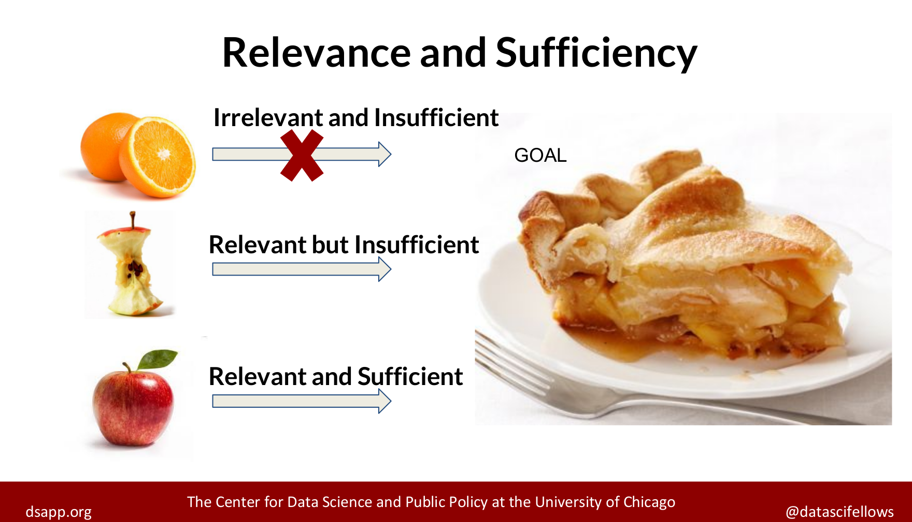
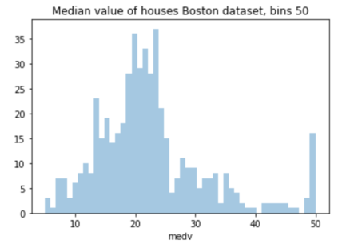
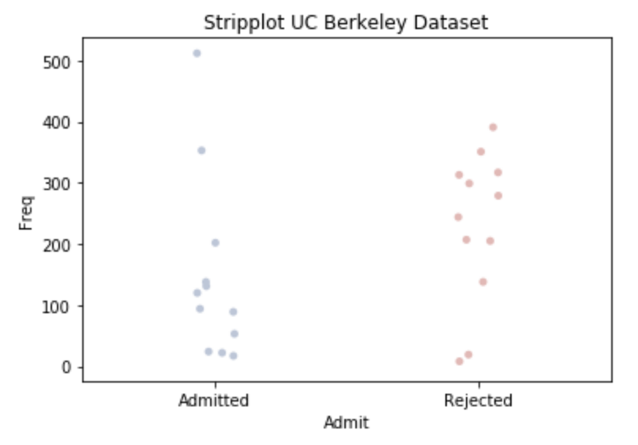

M. Sc. Liliana Millán Núñez liliana.millan@itam.mx

Septiembre 2020

## EDA

### Agenda

+ Qué es EDA
+ Tipos de EDA
+ EDA
+ GEDA
  + Reglas de visualización

***

#### EDA

+ Acrónimo de *Exploratory Data Analysis*.
+ Es una parte del proceso de análisis de datos **muy** importante, pues nos permite conocer y entender los datos que queremos analizar.
+ Podrías pensarlo como tu primera aproximación al problema que quieres resolver -primera cita-.
+ Es en esta fase donde realizamos muchas preguntas que queremos contestar con estos datos.
+ Nos permitirá establecer qué es factible de realizar con estos datos, conocer la granularidad de los mismos, las preguntas que se pueden resolver, etc.

##### Objetivo

+ Detectar errores en los datos, en los procesos que generan estos datos, en los procesos para obtener estos datos.
+ Detectar datos anómalos, faltantes.
+ Detectar datos aislados: Solo tenemos datos de lunes a viernes pero no de los fines de semana.
+ Verficar que tenemos datos relevantes y suficientes para contestar las preguntas que queremos contestar.
+ Verificar si la(s) pregunta(s) es la correcta
   + ¿se requiren más datos?
+ ¿Qué otras variables podemos obtener de este *set* de datos que nos permitan contestar tu(s) pregunta(s)? $\leftarrow$ lo veremos en *feature extraction / feature selection*
+ Verificar suposiciones que tengamos de los datos.
+ Selección preliminar de los modelos apropiados.
+ Determinar relaciones entre las variables explicativas.
+ Evaluar la dirección y tamaño -aproximado- de las relaciones entre las variables explicativas y la(s) variable(s) de salida -variable *target*-
+ Empezar a visualizar cómo sería la respuesta a la(s) pregunta(s) que quieres contestar con este set de datos

 De manera no estricta, si un análisis de datos no incluye modelado estadístico formal y/o inferencia/predicción entonces el análisis es EDA o estadística descriptiva.

#### Datos relevantes y suficientes

 
Fuente: [DSAPP](http://dsapp.uchicago.edu/)

Ejemplos:

Objetivo: Queremos predecir la calidad del aire del día de mañana en la Ciudad de México.

+ Datos irrelevantes e insuficientes: Tenemos las mediciones diarias de calidad de aire de estaciones de monitoreo de Culiacán del mes pasado.
+ Datos relevantes pero insuficientes: Tenemos las mediciones diarias de calidad de aire de estaciones de monitoreo de Ciudad de México de abril del 2000.
+ Datos relevantes y suficientes: Tenemos las mediciones diarias de calidad de aire de estaciones de monitoreo de la Ciudad de México desde hace 4 años.

 **Caso hipotético:** Estamos en el año 2017, contamos con los datos de la aplicación de UberEats de México -que solo tiene el 20% de los clientes de todo el país desde hace 1 mes (Julio 2017). Hoy, **12 de agosto del 2017** y queremos ocupar estos datos para predecir el porcentaje de chilangos que querrán comer chiles en nogada en la primer semana de septiembre para poder preparar ofertas y alertar a los comercios con la posible demanda a cubrir ... **únicamente** con estos datos, ¿en qué situación de datos relevantes-suficientes estamos?

### Tipos de EDA

Hay 2 grandes maneras cruzadas de clasificar el tipo de EDA:

1. Hacerlo de manera gŕafica o no -GEDA Graphical Exploratory Data Analysis, EDA Exploratory Data Analysis-
2. Cada método es univariado o multivariado -nonrmalmente bivariada-

+ **Análisis exploratorio no gráfico:** Generalmente incluye calcular el resúmen estadístico de
+ **Análisis exploratorio gráfico:** Resúmen los datos de forma gráfica
+ **Univariada:** Analizan una variable a la vez
+ **Multivariada:** Analizan 2 o más variables a la vez para explorar relaciones entre variables -normalmente bivariada-

 Se recomienda primero hacer un EDA univariado a cada variable que forme parte de un EDA multivariado ANTES de hacer el EDA multivariado

Después de clasificar en estos 4 tipos cruzados existen más divisiones al EDA basadas en:

a. El **rol de la variable**: salida o explicativa

b. El **tipo de la variable**: categórica o numérica

### EDA

Como parte del proceso de EDA tenemos que limpiar los nombres de las columnas:

+ Deben estar en minúsculas
+ Deben estar sin espacios (cambiar por guión bajo)
+ Si hay más de dos palabras, debe estar separados por guión bajo
+ No deben llevar acentos o signos de puntuación (cambiar por guión bajo)

En esta parte generaremos 2 tipos de análisis:

1. *Data Profiling*

Aquí queremos hacer estadística descriptiva básica, depende del tipo de dato que tengas lo que necesitarás obtener como estadística descriptiva básica.

+ Fechas
  + Fecha inicio
  + Fecha fin
  + Huecos en las fechas: sólo tenemos datos entre semana, etc.
  + Formatos de fecha (YYYY-MM-DD)
  + Tipo de dato: `date`, `time`, `timestamp`
  + Número de faltantes (NA)
  + Número de observaciones

+ Categóricos
  + Número de categorías únicas
  + Categorías únicas\* cuidado que algunas veces puedes tener cientos, miles e incluso millones!
  + Número de faltantes (NA)
  + Moda
  + Número de observaciones totales
  + Top 5 de valores repetidas

+ Numéricas
  + Valor mínimo
  + Valor máximo
  + Valor promedio
  + Desviación estándar
  + Cuartil 25%
  + Valor de la mediana
  + Cuartil 75%
  + Número de observaciones totales
  + Número de observaciones únicas
  + Número de valores faltantes (NA)
  + Top 5 de valores repetidos

+ Texto
  + Longitud máxima
  + Encoding
  + Longitud mínima
  + Longitud promedio

2. Estadística descriptiva no generada en el *data profiling*. Dependerá de tu *set* de datos.

+ Correlación
+ Covarianza
+ Curtosis: Qué tan punteaguda es la distribución
+ *Skewness*: Simetría en la distribución
  + Positiva: cola pesada a la derecha
  + Negativa: cola pesada a la izquierda
  + Cercana a cero: Casi simétrica

 Ir a notebook `eda.ipynb`

 Librería *Pandas profiling*

+ Esta librería nos permite hacer el *data profiling* de forma menos talachuda.
+ Puedes instalarla con `pip install pandas-profiling[notebook,html]`
+ Esta librería te generará un reporte con el *data profiling* de tus datos.
+ Solo hay que tener cuidado porque esta librería **no** verificará si los tipos de datos son correctos o no, y conforma al tipo de dato realizará el *profiling* pertinente.
+ Esta librería hace la combinación de *data profiling* con GEDA.

### GEDA o GDA

+ Acrónimo de *Graphical Exploratory Data Analysis* o *Graphical Data Analysis*
+ Aquí queremos sintetizar hallazgos de nuestro análisis a través de gráficas
+ Las gráficas deben ser claras, explícitas e idealmente sin necesidad de agregar texto para explicar lo que queremos mostrar (sin ambigüedad).

#### Reglas de visualización

+ No existe la gráfica perfecta para cada tipo de variable, dependerá de tu set de datos y el contexto en el que estos datos suceden, sin embargo, si hay reglas básicas de visualización que debes seguir.

+ Dado que no hay una gráfica perfecta es necesario probar con varios tipos de gráficas -que cumplan con las reglas de visualización- para identificar cuál muestra la información de la mejor manera.

+ Una gráfica debe ser explícita y **sin** posibilidad de ambigüedad en la información presentada $\leftarrow$ Recuerda que la mayoría de tomadores de decisiones solo ven una gráfica...

+ Tus gráficas siempre deben tener etiquetas que indiquen qué es el eje $x$ y qué es el eje $y$, así como un título de lo que estás graficando.

+ Si alguno de tus ejes ocupa número mayores a mil, siempre incluye comas (50,000) y si es necesario sintetiza las cantidades para facilitar la lectura (50k).

+ Incluye las unidades en las que se encuentra cada eje (\$).

+ Variables que suceden en el tiempo: Si quieres mostrar algo que sucede en el tiempo, es necesario que ocupes por cada observación un punto y una línea que los ligue, por lo tanto tu eje x debe ser el tiempo! [Connect your dot](https://www.data-to-viz.com/caveat/connect_your_dot.html)

+ Proporciones: **Nunca** ocupes gráficas de *pie*, el ojo humano no distingue correctamente proporciones utilizando ángulos!. [The issue with the pie chart](https://www.data-to-viz.com/caveat/pie.html). En lugar de ocupar *pies* ocupa barras horizontales ordenadas de mayor a menor! de esta manera siempre es explícito quién es el de mayor proporción y por cuánto.  

**Si me entregas una gráfica de *pie* en cualquier tarea, ¡tu tarea tiene 0!**

En lugar de hacerlo asi:

 

Mejor poner la información así:

 

Ejemplos de visualizciones mal utilizadas (╯°□°)╯︵ ┻━┻:

 
Fuente: [flowingdata.com](https://flowingdata.com/2009/11/26/fox-news-makes-the-best-pie-chart-ever/)

 
Fuente: [flowingdata.com](https://flowingdata.com/2010/05/14/wait-something-isnt-right-here/)

 
Fuente: [flowingdata.com](https://flowingdata.com/2012/11/09/incredibly-divided-nation-in-a-map/)

 
Fuente: [WTF Visualizations](https://viz.wtf/)

 
Fuente: [WTF Visualizations](https://viz.wtf/)

 
Fuente: [WTF Visualizations](https://viz.wtf/)

 
Fuente: [WTF Visualizations](https://viz.wtf/)

 
Fuente: [WTF Visualizations](https://viz.wtf/)

 
Fuente: [WTF Visualizations](https://viz.wtf/)

**Variables numéricas**

+ **Histograma**: Simetría/Asimetría, huecos, multimodalidad, aproximación a una distribución **empírica**. Una variable (numérica o categórica).
+ **Diagrama de caja y brazos** -boxplot-: outliers, amontonamientos. Cuartiles 25%, 50%, 75%.
+ **Scatterplot**: Cada dato es un punto, permite identificar huecos. Dos variables numéricas. Identificar relación (co) entre variables por ejemplo explicativa y output.
* **Rugplot**: Gráfica que agrega pequeñas líneas verticales (eje x) u horizontales (eje y), se ocupa como un extra a un scatterplot.
+ **Density estimate**: Como un modelo de tus datos... solo ten cuidado con los límites de las variables.
+ **Distribution estimate**: Permite comparar distribuciones como por ejemplo si una está adelante de otra.
+ **QQ-plot**: Permite comparar dos distribuciones, la tuya vs una teórica (por default la normal).
+ **Matriz de correlación**: Permite identificar correlaciones entre variables.  

**Histogramas**

¿Qué información podemos obtener del siguiente histograma?

 
Fuente: [Graphical Data Analysis with R](https://www.crcpress.com/downloads/K25332/Chapter_1.pdf)

 
Fuente: [Graphical Data Analysis with R](https://www.crcpress.com/downloads/K25332/Chapter_1.pdf)

 La información obtenida de cada gráfica requerirá que pruebes con diferentes variables y configuraciones -tamaños de bines, etc.-, explora todas estas opciones para llegar a la información adecuada. ¡No te apresures en tus conclusiones!

Tenemos los datos de admisiones a [UC Berkeley en 1973](http://www-eio.upc.edu/~pau/cms/rdata/datasets.html), queremos saber si en la admisión hay un sesgo por género.

 
Fuente: [Graphical Data Analysis with R](https://www.crcpress.com/downloads/K25332/Chapter_1.pdf)

 
Fuente: [Graphical Data Analysis with R](https://www.crcpress.com/downloads/K25332/Chapter_1.pdf)

Datos de los [precios de casas en Boston USA](http://www-eio.upc.edu/~pau/cms/rdata/datasets.html).

 

 

 

 

 

**Nota:** Se utilizan colores secuenciales (degradados) cuando utilizamos variables numéricas que están relacionadas a una disminución o aumento -heatmaps-, se utilizan colores divergentes cuando utilizamos variables categóricas.

**Boxplots**

Con los datos de [diabetes de la India](https://archive.ics.uci.edu/ml/datasets/diabetes) de la librería de UCI de machine learning.

¿Qué información podemos obtener del siguiente *boxplot*? Se muestran las 6 variables numéricas del set.

 

 

**Scatterplot**

¿Qué información podemos obtener del siguiente *scatterplot*?

Datos Iris:

 

Datos Boston:

 

**Matriz de correlación**

¿Qué información podemos obtener de la siguiente gráfica de correlaciones?

Datos Boston:

 

**Variables categóricas**

+ **Barplot:** Nos permite identificar categorías extra, errores, faltantes, distribución.
+ **Stripplot:** Nos permite graficar un *scatterplot* con una variable categórica y una numérica.
+ **Doubledecker:** Permite visualizar una regla de clasificación. Tablas de contingencia.

**Barplot**

Datos UC Berkeley

 

O

 

 

**Stripplot**

Por default tiene *jitter* para que se vean mejor las observaciones.

 

 

**Doubledecker**

Datos de admisiones de UC Berkeley.

 
Fuente: [Graphical Data Analysis with R](https://www.crcpress.com/downloads/K25332/Chapter_1.pdf)

### Tarea 1

**Individual**, entrega el **28 de septiembre del 2020 máximo a las 23:59:59 CST (hora CDMX)** al correo liliana.millan@itam.mx con el *subject* **md_tarea_1**. **-0.5 por cada día de retraso.**

Tenemos los datos de vuelos pertenecientes a todos los aeropuertos de Estados Unidos en el archivo `flights.csv` que se encuentra en la siguiente [liga](https://drive.google.com/drive/folders/1_gUNibH3-d-gQPISiZUOB8DbClWiRWC8?usp=sharing).

En este set de datos se incluyen acrónimos de aerolíneas y aeropuertos, los nombres asociados a esos acrónimos se encuentran en los archivos `airlines.csv` y `airports.csv` respectivamente que se encuentran en esta [liga](https://drive.google.com/drive/folders/1_gUNibH3-d-gQPISiZUOB8DbClWiRWC8?usp=sharing) y esta [liga](https://drive.google.com/drive/folders/1_gUNibH3-d-gQPISiZUOB8DbClWiRWC8?usp=sharing).

Queremos hacer un EDA de estos datos que nos servirá para poder responder la pregunta de si un vuelo tendrá demora en su salida o no.

-> **No haremos ningún modelo -todavía-**

#### Qué hay que hacer

+ La tabla final del *Data Profiling* de todas las variables. Una por tipo de variable, es decir, si hay variables de tiempo una tabla de su respectivo Data Profiling, una para variables categóricas, una para variables numéricas y una para variables de texto. El *Data Profiling* debe incluir todas las métricas enlistadas en la sección de *Data Profiling*.
+ Interpretación de cada tabla de *Data Profiling* generada.

+ Contestar las siguientes preguntas:
1. ¿Cuántas aerolíneas existen en tu *dataset*?
2. ¿Cuántos aviones -`tail number`- diferentes existen en tu *dataset*?
3. ¿De qué periodo de tiempo tienes vuelos? ¿Tienes datos de todos los días en ese periódo?
4. ¿Cuál es el día de la semana con menor demoras de salida?
5. ¿Cuál es el origen-destino con el mayor porcentaje de demoras en su salida? ¿Qué porcentaje es?
6. ¿Cuál es el aeropuerto destino con mayor número de demoras (número, no duración de la demora)? ¿De qué aerolíneas son el top 3 de demoras de este aeropuerto?
7. ¿Cuál es el aeropuerto origen con mayor número de demoras (número, no duración de la demora)? ¿De qué aerolíneas son el top 3 de demoras de este aeropuerto?
8. ¿Qué aerolíneas vuelan de Atlanta (Hartsfield-Jackson Atlanta International Airport) a Hawaii (Honolulu International Airport) y en qué dias de la semana y horarios?
9. Si queremos viajar de Atlanta (Hartsfield-Jackson Atlanta International Airport) a Hawaii (Honolulu International Airport) en qué día nos conviene hacerlo para no tener demoras en nuestra salida.
10. Si queremos viajar de Atlanta (Hartsfield-Jackson Atlanta International Airport) a Hawaii (Honolulu International Airport) en qué día nos conviene hacerlo para no tener demoras en nuestra llegada.
11. Si queremos viajar de Atlanta (Hartsfield-Jackson Atlanta International Airport) a Hawaii (Honolulu International Airport) en qué día nos conviene hacerlo para no tener demoras en nuestro viaje. (demora incluyendo demora de salida y demora de llegada).
12. ¿Qué aerolínea es a la que más destinos llega?
13. ¿Qué aeropuerto es el que recibe más destinos?
14. ¿Qué aeropuerto es el que llega a más destinos?
15. ¿Qué aeropuerto es el más puntual los fines de semana para salidas?
16. ¿Qué aeropuerto es el más puntual los lunes para salidas?
17. ¿Qué aeropuerto es el más puntual en todos sus viajes salidas y llegadas?
18. ¿Cuál es la ruta con menor demora? ¿Por cuánto es la demora? (Tienen que tener demora, demora = demora de salida + demora de llegada).
19. ¿Cuál es la ruta con mayor demora? ¿Por cuánto es la demora? (demora = demora salida + demora de llegada).
20. En qué día de la semana debemos viajar desde el aeropuerto John F. Kennedy para no tener demora en la salida (sin importar el destino).

+ Seleccionar 5 gráficas de tu EDA que tengan los *insights* más importantes de tus datos (relacionados a la pregunta que queremos responder).
+ ¿Tienes datos relevantes y suficientes para la pregunta que queremos contestar?

NOTA: El día de la semana 1 corresponde al Lunes.

#### Qué hay que entregar

+ El *jupyter notebook* con el código que utilizaste para cada punto solicitado
+ El *jupyter notebook* debe incluir comentarios de explicación, piensa que este es el reporte que le estas entregando a tu cliente (Liliana).
+ Interpretación de las tablas, gráficas que integres al reporte.
+ Los aeropuertos y aerolíneas deben ser especificados con su nombre no con su acrónimo, y debe ser obtenido a través de usar *join* de tablas.

### Referencias

+ [Data to Viz](https://www.data-to-viz.com/caveats.html)
+ [Graphical Data Analysis wiht R](https://www.amazon.com/Graphical-Data-Analysis-Chapman-Hall/dp/1498715230)
+ [The worst chart in the world](https://www.businessinsider.com/pie-charts-are-the-worst-2013-6)
+ [Tutorial Seaborn](https://seaborn.pydata.org/tutorial.html)
+ [Página de Seaborn](https://seaborn.pydata.org/index.html)
+ [Seaborn API](https://seaborn.pydata.org/api.html)
+ [Librería Pandas Profiling](https://github.com/pandas-profiling/pandas-profiling)
