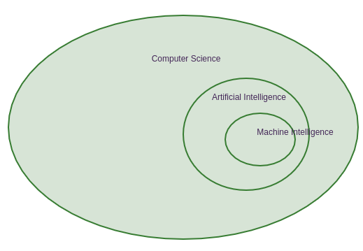
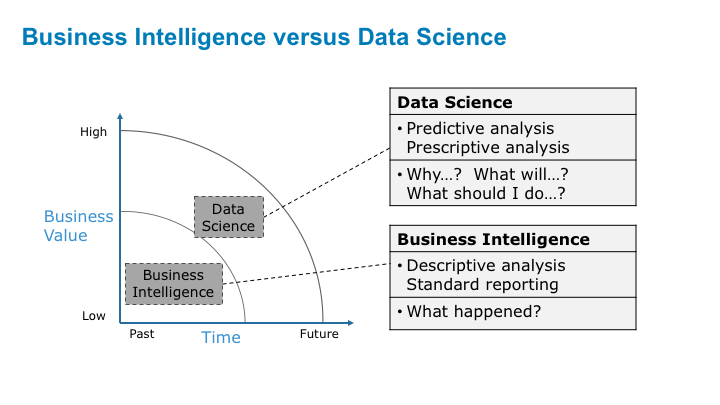
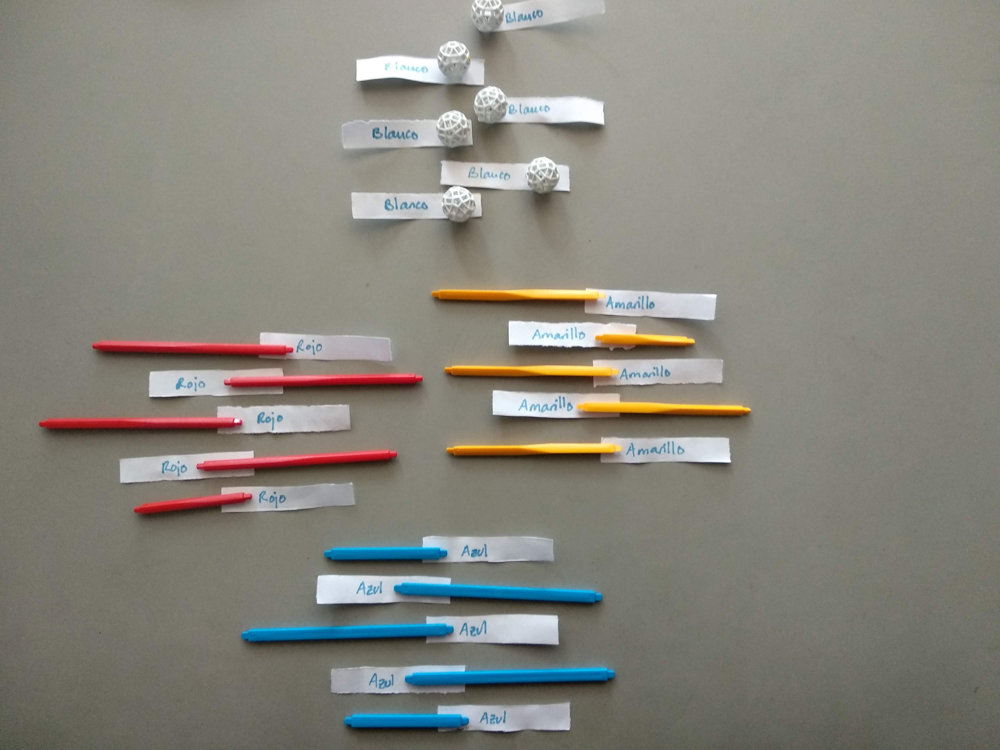

M. Sc. Liliana Millán Núñez liliana.millan@itam.mx

Septiembre 2020

## Introduccion a Machine Learning

### Agenda

+ *Machine Learning*
+ *Business intelligence* vs ML
+ Tipos de aprendizaje

### Machine Learning

 

 
Fuente: [Oracle Data Science Blog](https://blogs.oracle.com/datascience/types-of-machine-learning-and-top-10-algorithms-everyone-should-know-v2)

### Business Intelligence vs ML

 
Fuente: [Data Science Central Blog](https://www.datasciencecentral.com/profiles/blogs/updated-difference-between-business-intelligence-and-data-science)

#### Business Intelligence

+ Las preguntas están muy bien definidas (*scoping*)
+ Las preguntas siempre vienen de gerentes, directivos y CxOs
+ Análsis descriptivo
+ Análisis post-mortem, una vez que ya sucedió
+ Siempre se genera un reporte con visualización
  + En un pdf enviado por mail a personas específicas
  + En un *dashboard*
+ Generan cubos, trabajan con cubos

#### ML

+ Predictivo
+ Nos interesa ser preventivos más que reactivos
+ Inclusive se puede hacer análisis causal
+ Las preguntas vienen más de quien analiza los datos, aunque todas están bajo el contexto de un problema particular de la empresa
+ Datos estructurados y no estructurados
+ Datos de cualquier "tamaño" y dimensión
+ Los algoritmos de ML responden **1 sola** respuesta a la vez!, si se requiere de responder varias preguntas, cada una tendrá su propio algoritmo de ML (es posible conectarlas ocupando la predicción de un algoritmo como variable de entrada de otro)

 En minería de datos y ciencia de datos, **correlación no implica causalidad**. Existen modelos específicos de causalidad -y especialidades dedicadas únicamente a eso!-

### Tipos de aprendizaje

#### Aprendizaje supervisado

+ Conocemos la respuesta correcta de antemano.
+ Esta respuesta correcta fue "etiquetada" por un humano (la mayoría de las veces, en algunas circunstancias puede ser generada por otro algoritmo).
+ Debido a que conocemos la respuesta correcta, existen muchas métricas de desempeño del modelo para verificar que nuestro algoritmo está haciendo las cosas "bien".
+ El aprendizaje más sencillo pero más

#### Tipos de algoritmos

**Clasificación**

+ La respuesta correcta es un valor categórico.
+ La variable respuesta -*target*- debe tener más de 2 valores diferentes.
  + Binarias: Si/no, 0/1, False/True, Sube/Baja, Alto/Bajo, etc.
  + Multinomiales: Alto/Medio/Bajo, Si/No/Tal vez, Azul/Rojo/Amarillo/Verde/Morado, 0/1/2/3/4/5.../10, etc.

**Regresión**

+ La respuesta correcta es un valor numérico entero o real.
+ **No** confundir con algoritmos de regresión.

##### Algoritmos de ejemplo

+ Árboles
+ RandomForest
+ SVM
+ Redes neuronales
+ XGBoost
+ Redes neuronales profundas
+ GLM
+ KNN
+ Otros

**Ejemplo clasificación**

Tenemos el siguiente *set* de datos (etiquetado) con el que entrenamos un modelo de clasificación:

 

+ ¿Cuántas categorías tenemos?

Este es nuestro *set* de pruebas, ¿qué predicción darías a cada observación?

 

 ML **no** es 100\% "preciso" (más adelante hablaremos de eso) y **no debe** ser 100\% preciso.

**Ejemplo regresión**

Tenemos el siguiente *set* de datos (etiquetado) con el que entrenamos un modelo de clasificación:

 

+ ¿Cuántas categorías tenemos?

Este es nuestro *set* de pruebas, ¿qué predicción darías a cada observación?

 

#### Aprendizaje no supervisado

+ Aquí no tenemos la respuesta correcta de antemano ¿cómo podemos saber que el algoritmo está bien o mal?
+ Estadísticamente podemos verificar que el algoritmo está bien
+ Siempre tenemos que verificar con el cliente si los resultados que etamos obteniendo tienen sentido de negocio. Por ejemplo, número de grupos y características

#### Tipos de algoritmos

+ **Reducción de dimensionalidad**

En este tipo de algoritmos queremos reducir el número de dimensiones que tenemos -variables- en nuestro *dataset* conservando la mayor cantidad de información posible al hacer esta reducción. $leftarrow$ Más adelante veremos por qué esto es importante.

**Algoritmos**

+ PCA: Variables numéricas
+ CATPCA: Variables categóricas

+ **Agrupación**

En este tipo de algoritmos queremos agrupar los datos que tenemos encontrando patrones que los hacen similares. Cómo definamos similitud será lo que nos permita tener diferentes algoritmos para generar estos grupos.

**Ejemplo**

Tenemos el siguiente *set* de datos:

 

 ¿Cómo podemos agrupar estos datos?

 

 

 

**Algoritmos**

+ K-Means
+ HClust
+ DBScan
+ HDBScan
+ t-SNE
+ ...

+ **Asociación**

En este tipo de algoritmos lo que queremos es encontrar relaciones que suceden juntas con cierta frecuencia en nuestro *dataset*, también conocidos como *Market Basket Analysis*.

Las asociaciones pueden ser desde 2 cosas que suceden al mismo tiempo hasta n cosas.

Este tipo de modelos se aplican en Amazon para recomendar productos que te pueden interesar, lo veremos más adelante.

**Algoritmos**

+ A-priori

**Ejemplo**

Tenemos el siguiente *set de datos*:

 

Existen las siguientes asociaciones en nuestros datos: Asociaciones de 1 elemento, 2 elementos, 3 elementos, etc.

 

Nota que conforme tu número de elementos aumenta en la asociación, necesitas mucho más observaciones para "sostener" esa asociación. $leftarrow$ Veremos esto más adelante.

¿Cuál es la asocación que aparece con mayor frecuencia?

 

#### Aprendizaje por refuezo

+ Se parece más a la forma en la que los humanos aprendemos. Por ejemplo aprender a caminar
+ En este tipo de aprendizaje se utiliza la "experiencia" para aprender
+ Optimizamos una función de costo que incluye recompensas y castigos
+ Se **requiere** de tener historia con diferentes estrategias aplicadas! para tener las recompensas y castigos adecuados
+ Cuando se requieren de recomendar una estrategia, este es el tipo de aprendizaje a utilizar
+ Une diferentes disciplinas: Agentes inteligentes, teoría de juegos.
+ **No** veremos este tipo de aprendizaje en esta clase
