M. Sc. Liliana Millán Núñez liliana.millan@itam.mx

Noviembre 2020

### Agenda

+ HClust
+ Algoritmo
+ Ejercicio

****

### Hierarchical Clustering

+ `HClust` es uno de los algoritmos que se ocupan para hacer agrupación jerárquica. También son conocidos como **dendrogramas**.

+ El número de clusters depende del nivel de corte en la jerarquía
+ No requiere de parámetros de entrada, solo los datos con los que se armará el dendograma

### Procedimiento

El algoritmo de `HClust` genera grupos tomando en cuenta la distancia entre los elementos y formando jerarquías entre pares de datos que son similares.

Este algoritmo toma una aproximación *bottom-up*, esto es, comienza a generar grupos entre pares de elementos, por lo que al inicio **cada elemento** es un *cluster*.

El proceso para generar los clusters es el siguiente:

1. Cada elemento en el conjunto de datos es un *cluster*
2. Calculamos la distancia de cada elemento a todos los elementos restantes
3. Encontramos el par de *clusters* que sean más similares y los unimos para formar un nuevo *cluster*
4. Calculamos la distancia entre el nuevo *cluster* y el resto de los *clusters*
5. Se repiten los pasos 3 y 4 hasta que ya no hay más *clusters* a unir

Para ir juntando *clusters* el algoritmo `HClust` selecciona los que sean "más similares" de acuerdo alguna de las 4 siguientes métricas para calcular distancias, ya sea entre elementos o grupos completos:

1. *Single linkage*
2. *Complete linkage*
3. *Average linkage*
4. *Centroid linkage*

#### Single linkage

En este método, la distancia entre dos grupos se calcula obteniendo la distancia entre los elementos más cercanos en estos grupos.

Esta métrica tiene la desventaja de que puede juntar grupos prematuramente, aún y cuando los grupos sean muy disimilares.

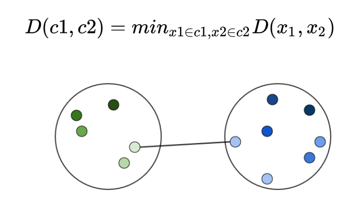
 

#### Complete linkage

En este método, la distancia entre dos grupos  se calcula obteniendo  la distancia de los elementos que se encuentren más lejanos entre diferentes *clusters*.

Esta métrica tiene la desventaja de que en caso de que haya valores atípicos, provocará que se unan grupos que tal vez no deberían haberse unido, o que hubiera sido mejor que se unieran después.

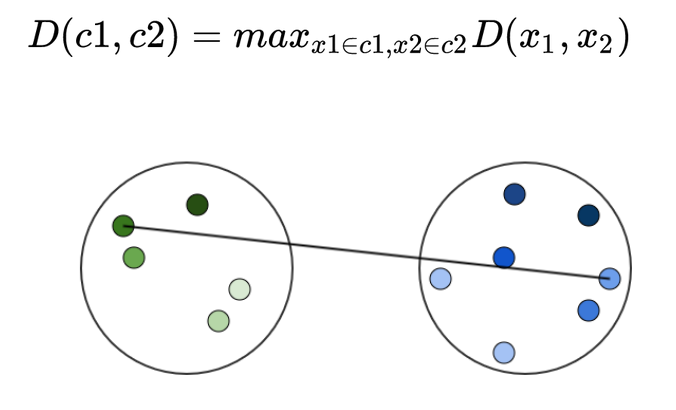
 

#### Average linkage

En este método, la distancia entre dos grupos está definida por el promedio en la distancia de todos los elementos de un grupo contra todos los elementos de otro grupo.

A diferencia de las otras métricas vistas, en ésta, la distancia se calcula entre grupos completos.

Esta métrica tiene la ventaja de que no es tan afectada por valores atípicos.

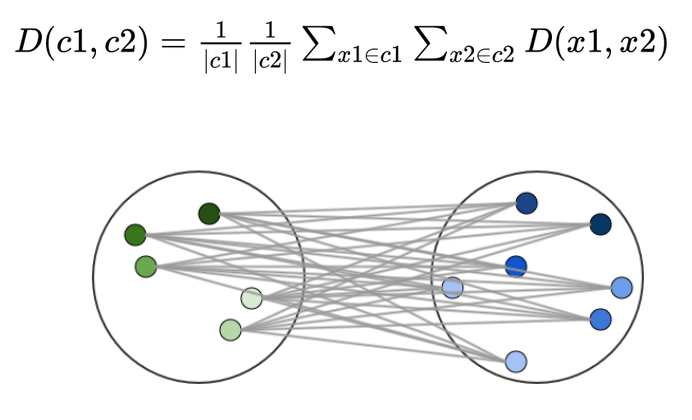
 

#### Centroid linkage

En este método, la distancia entre 2 grupos se calcula utilizando la distancia entre los centroides de los grupos.

Esta métrica tiene la desventaja de que en caso de que haya valores atípicos, provocará que se unan grupos que tal vez no deberían haberse unido, o que hubiera sido mejor que se unieran después.

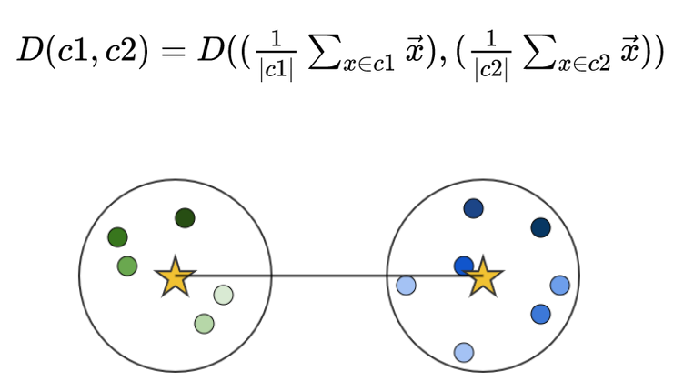
 

### Selección de grupos

Una vez que todos los *clusters* han sido unidos, tendremos que definir cuántos grupos queremos tener, esta definición hará que cortemos el árbol generado.

Por ejemplo, en la imagen del árbol que se muestra, si cortamos en 10 tendremos 3 grupos.

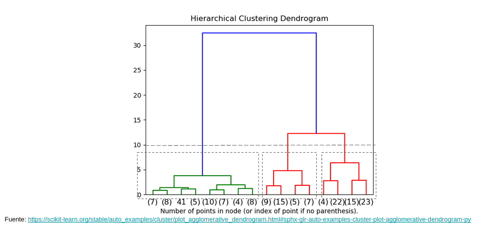
 

### Ejemplo

Tenemos un conjunto de datos que incluye la distancia en kilometros entre ciudades italianas, queremos generar *clusters* de ciudades con distancias 'similares' utilizando el método de *single-link*

+ **Paso 1:** Obtenemos la matriz de distancias entre todos los datos del set

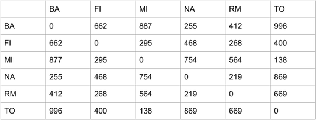
 

**Paso 2:** ok

**Paso 3:** Buscamos cuál es el par de ciudades con distancia más similar —la menor distancia entre ellas— **MI-TO**

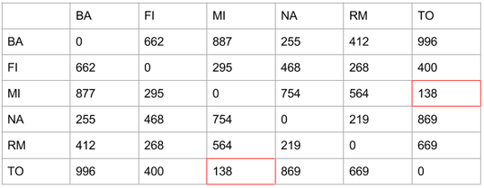
 

Iniciamos el dendograma, nota que la altura del dendograma está relacionada a la distancia entre los nodos

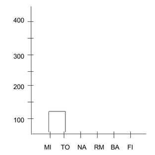
 

**Paso 4:** Recalculamos las distancias de los nodos que han sido afectados con la cohesión en el paso 3, seleccionamos la menor distancia. En nuestro caso tenemos:

|MI|TO|Menor distancia|
|:--:|:---:|:--:|
|887|996|887|
|295|400|295|
|0|138|0|
|754|869|754|
|564|669|564|
|138|0|0|

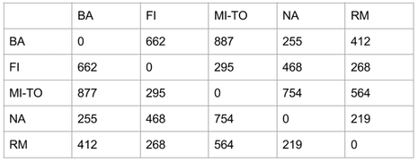
 

**Paso 5:** Iteramos. Menor distancia: **NA-RM**

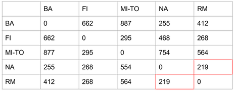
 

Dendrograma:

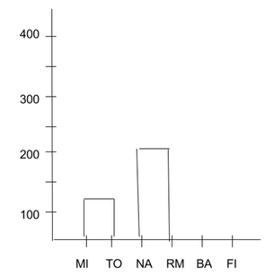
 

Cohesíón y actualización, tenemos:

|NA|RM|Distancia mínima|
|:--:|:--:|:--:|
|255|412|255|
|468|268|268|
|754|564|564|
|0|219|0|
|219|0|0|

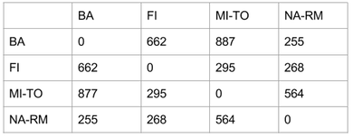
 

Siguiente iteración **BA-NA-RM**

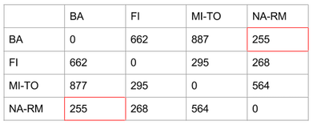
 

Dendrograma:

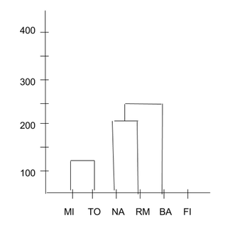
 

Cohesión y actualización

|BA|NA-RM|Distancia mínimo|
|:--:|:--:|:--:|
|0|255|0|
|662|268|268|
|877|564|564|
|255|0|0|

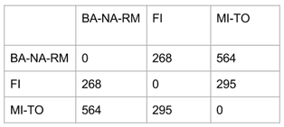
 

Siguiente iteración **BA-NA-RM-FI**

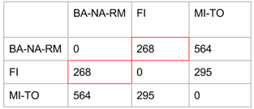
 

Dendrograma>

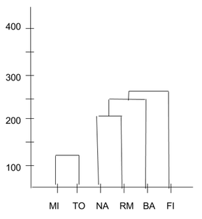
 

Cohesión y actualización

|BA-NA-RM|FI|Distancia mínima|
|:--:|:--:|:--:|
|0|268|0|
|268|0|0|
|564|295|295|

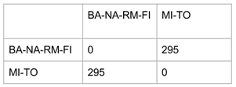
 

Última iteración **BA-NA-RM-FI-MI-TO**

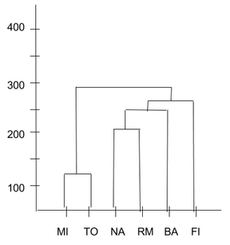
 

Una vez que terminamos de armar los clusters, debemos elegir qué número de clusters es el mejor para cortar el árbol de acuerdo a los datos. A diferencia de k-means, aquí no hay una forma estadística 'formal' de identificar qué `k` es la mejor, lo tenemos que seleccionar con base en el dendrograma construido y en que nosotros seleccionemos que tan general/grandes queremos que sean los grupos. Recuerda que el objetivo es identificar los `k` grupos que engrupan elementos similares.

 Notebook `hclust.ipynb`
