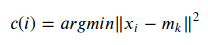
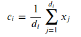

M. Sc. Liliana Millán Núñez liliana.millan@itam.mx

Noviembre 2020

### Agenda

+ K-means
+ Algoritmo
+ Ejercicio

***

### K-means

Es uno de los métodos de agrupamiento más ocupado debido a su facilidad de implementación, en este método de agrupamiento se asignan `k` centroides apriori —uno para cada grupo— y cada dato se asigna a uno de los centroides. El objetivo es minimizar la varianza total de un grupo con respecto al centroide al que pertenece.

En este algoritmo cada dato forma parte de un solo grupo —a su centroide más *cercano*— ¿cómo medimos cercanía? $\rightarrow$ generalmente con distancia euclidiana del punto a medir con respecto a cada centroide, el punto pertenecerá al centroide que esté más cercano a él.

Los párametros que requiere este algoritmo son:

+ Número de grupos en los que hay que dividir el data set ¿Qué no lo que queríamos saber es cuántos grupos hay en el data set?
+ Posición incial/valor inicial de los centroides de cada grupo
+ Número de repeticiones

#### Algoritmo:

1. Seleccionar los `k` centroides aleatoriamente
2. Por cada observación en el *set* de datos calcular su distancia euclideana a los `k` centroides

3. Seleccionar el centroide con la menor distancia
4. Asignar ese dato al grupo seleccionado
5. Una vez que todas las observaciones fueron asignadas a un centroide, actualizamos el valor de los `k` centroides —actualizamos los centros— tomando la distancia promedio de todos los que pertenecen al mismo grupo

Donde:

`d_i`: Datos en el cluster `i`

6. Regresar al paso 2 hasta que se llegue a un número máximo de iteraciones establecido o bien hasta que ya no haya reasignación de los centroides

### Simulación

[Simulación K-means](http://tech.nitoyon.com/en/blog/2013/11/07/k-means/)
