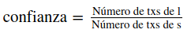

M. Sc. Liliana Millán Núñez liliana.millan@itam.mx

Noviembre 2020

## Modelos de asociación

### Agenda

+ Modelos de asociación
+ A-priori
+ Ejercicio
+ Implementación en sklearn

### Modelos de asociación

Los métodos de asociación son muy ocupados en análisis de tipo market basket: conocer qué productos se compran juntos, permite hacer sistemas de recomendación como Amazon: "los clientes que compraron este producto también compraron"

Los métodos de asociación tiene como objetivo encontrar asociaciones entre los datos de un set que aparezcan en una **fracción significativa** del mismo.

Los casos de uso más comúnes en *market basket analysis* son: Dadas las asociaciones entre productos

+ Saber qué productos poner juntos en un estante
+ Descuentos inteligentes de un producto que se compensan con otro
+ Publicidad dirigida a los clientes de un producto para que compre el otro producto
+ Combinar productos asociados, por ejemplo sabor de un producto con el color de otro

Otros casos de uso incluyen análisis genéticos donde nos interesa encontrar asociaciones entre genes —presencia de un gen dado otro—, análisis biológicos donde nos interesa encontrar proteínas que se activan dada la presencia de otra, *profiling* de bases de datos: valores entre columnas que aparecen normalmente juntos permiten identificar columnas en diferentes tablas que son iguales.

### Algoritmo Apriori

+ Este algoritmo encuentra asociaciones entre atributos —columnas— de un *set* de datos, para ello tiene que revisar **todo** el set de datos!!! que irá disminuyendo en diferentes iteraciones conforme se van agregando atributos a la asociación
+ Los atributos de los que se buscará asociación tienen que ser **discretos**
+ Para que una relación destaque tiene que aparecer "muchas veces" en el *set*, por lo que es difícil destacar relaciones en *sets* de datos que tengan muchos atributos
+ Las combinaciones entre diferentes columnas pronto se vuelven intratables, pues hay que ir agregando asociaciones de más de 2 atributos
+ Para hacer el problema tratable se van eliminando observaciones que no cumplen *cierto threshold* de presencia utilizando la métrica de **soporte**, **confianza** y **lift**
+ Este algoritmo es computacionalmente caro pues en la primera iteración se requiere de contar todas las ocurrencias de todos los tipos de atributos que tiene el set de datos.

##### Métricas

+ **Soporte:** La popularidad de un *item* -o asociación-. La frecuencia con la que aparece una asociación en el *set* de datos, está medida en porcentaje como:

 Mientras más grande sea el soporte mejor es la asociación.

+ **Confianza:** Mide qué tan probable es que un atributo A esté presente si el atributo B está presente, se mide en porcentaje.

Por ejemplo: Galletas (A) y Leche (B), el numerador sería el número de transacciones en donde hubo galletas y leche en el mismo "ticket" y el denominador sería el número de transacciones en las que hubo galletas.

+ **Lift:** Permite identificar cuánto incrementa el "ticket" de B cuando se "vende" A, es decir, cuánto sube A a B.

Por ejemplo: Si el lift de Galletas con Leche fuera de 2.5, nos indica que es 2.5 veces más probable que las Galletas se compren junto con la Leche que solo la Leche.

##### Características principales

+ Se aplica a bases de datos **transaccionales**, cada renglón corresponde a una transacción 'ticket' y cada columna corresponde al 'item(s)' adquirido(s) en esa transacción
+ Se inicia con todos los registros de la base de datos y conforme avanza el número de iteraciones se van eliminando variables que no cumplen con el criterio mínimo de ocurrencia
+ Permite eliminar ocurrencias donde elementos que la componen no cumplieron con el criterio de frecuencia por lo que no hay que escanear toda la base de datos todo el tiempo, solo en la primer revisión
+ Obtenemos las combinaciones —asociaciones— que más ocurren en la base de datos
+ Es un algoritmo computacionalmente caro pues requiere al menos la primera vez de contar todas las ocurrencias de todos los tipos de 'item' en la base de datos

##### Parámetros de entrada

+ Definición de **frecuencia mínima de ocurrencia**: ¿Cuántas veces debe aparecer un —item— para ser considerado frecuente?

##### Algoritmo

1. Definir un mínimo de Soporte y un mínimo de Confianza. El primero nos servirá para filtrado de transacciones mientras que el segundo nos servirá para filtrar reglas de asociación.

2. Calculamos el soporte de cada *item* en el *set* de datos.

3. Filtrar las transacciones que tengan un soporte mayor o igual al definido en el paso 1.

4. Se agrega un siguiente *item* para la siguiente iteración regresando al paso 2.

 Criterio de paro: Si ya no hay más combinaciones que analizar o registros que revisar en la base de datos que cumplan con el criterio mínimo de soporte.

5. Generar las reglas de asociación con todos los subsets que sobrevivieron a las diferentes iteraciones.

6. Filtrar las reglas que cumplen con el nive de Confianza establecida.

7. Ordenar las reglas que quedaron en el paso 6 por Lift de manera descendente, de tal forma que las reglas que mostramos primero tienen un mayor Lift.

##### Desventajas

+ ¿Cómo definimos un "buen" umbral de frecuencia de ocurrencia?
+ Si el umbral de frecuencia es muy pequeño se tendrán que generar muchas iteraciones
+ Computacionalmente caro, se requieren hacer todos los conteos la primera vez

### Ejemplo

Queremos encontrar asociaciones que tengan un soporte de al menos frecuencia `3 -> 3/8 = 0.37 -> 37%` y confianza del 60%

 

+ **Primera iteración:** asociaciones de tamaño 1

 

+ Debido a que el threshold de soporte es de 3, se eliminan aquellas observaciones —renglones— que incluyan atributos que no cumplen con ese threshold —{yakult}—, por lo tanto nos queda el siguiente nuevo set reducido:

 

+ **Segunda iteración:** asociaciones de tamaño 2 **con el set resultante de la iteración anterior**
Generamos todas las posibles combinaciones de tamaño 2 entre los atributos que pasaron el threshold

 

+ Eliminamos las asociaciones que tengan un soporte menor a 3 —{pañales,cerveza},{pañales,servilletas}—

 

+ **Tercera iteración** asociaciones de tamaño 3, debido a que la combinación {pañales,cerveza} y {pañales,servilletas} fueron eliminadas ... no hay combinación de 3 elementos que incluya {pañales} que sea posible -dadas las transacciones- y la única combinación posible con los datos que quedan en el set es {cerveza,manzanas,servilletas}

 

+ Ya no hay más combinaciones ni se cumple con el soporte mínimo, hemos terminado las iteraciones

+ Generar una lista con las reglas que sobrevivieron: `[{pañales},{cerveza},{manzanas},{servilletas},{pañales,manzanas},{cerveza,manzanas},{cerveza,servilletas},{manzanas,servilletas},{cerveza,manzanas,servilletas}]`

+ Tomar las asociaciones más largas y verificar *threshold* de confianza:

      `l={cerveza,manzanas,servilletas}`

      `s=[{manzanas,servilletas},{cerveza,servilletas},{cerveza,manzanas},{cerveza},{manzanas},{servilletas}]`

   + Regla 1: `s={manzanas,servilletas}`

       `{manzanas,servilletas} -> cerveza`

       

       

        Seleccionamos la regla 1

   + Regla 2: s={cerveza,servilletas}

       `{cerveza,servilletas} -> manzanas`

       

       

        Seleccionamos la regla 2

   + Regla 3: `s={cerveza,manzanas}``

       `{cerveza,manzanas} -> servilletas`

       

       

        La regla 3 se descarta

   + Regla 4: `s={cerveza}`

       `{cerveza} -> {manzanas,servilletas}`

       

       

        La regla 4 se descarta

   + Regla 5: `s={manzanas}`

       `{manzanas} -> {cerveza,servilletas}`

       

       

        La regla 5 se descarta

   + Regla 6: `s={servilletas}`

       `{servilletas} -> {cerveza,manzanas}`

       

       

        La regla 6 se descarta

 Ir al notebook `association.ipynb`
