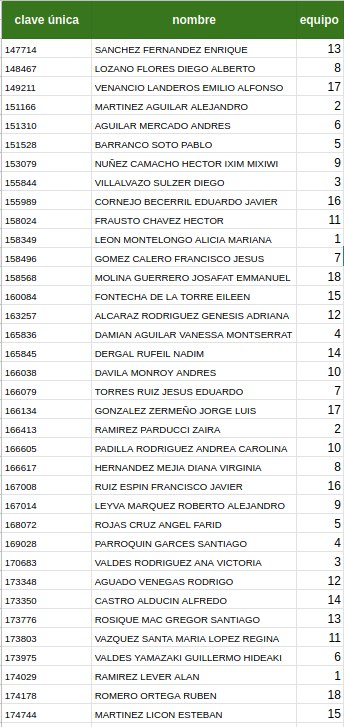

M. Sc. Liliana Millán Núñez liliana.millan@itam.mx

Noviembre 2020

### Proyecto 1

Cuentas con los datos de la empresa ABC que se dedica a transporte.

1. Individual identification (ID)
2. Reason for absence (ICD).

Absences attested by the International Code of Diseases (ICD) stratified into 21 categories (I to XXI) as follows:

+ I Certain infectious and parasitic diseases
+ II Neoplasms
+ III Diseases of the blood and blood-forming organs and certain disorders involving the immune mechanism
+ IV Endocrine, nutritional and metabolic diseases
+ V Mental and behavioural disorders
+ VI Diseases of the nervous system
+ VII Diseases of the eye and adnexa
+ VIII Diseases of the ear and mastoid process
+ IX Diseases of the circulatory system
+ X Diseases of the respiratory system
+ XI Diseases of the digestive system
+ XII Diseases of the skin and subcutaneous tissue
+ XIII Diseases of the musculoskeletal system and connective tissue
+ XIV Diseases of the genitourinary system
+ XV Pregnancy, childbirth and the puerperium
+ XVI Certain conditions originating in the perinatal period
+ XVII Congenital malformations, deformations and chromosomal abnormalities
+ XVIII Symptoms, signs and abnormal clinical and laboratory findings, not elsewhere classified
+ XIX Injury, poisoning and certain other consequences of external causes
+ XX External causes of morbidity and mortality
+ XXI Factors influencing health status and contact with health services.

And 7 categories without (CID) patient follow-up (22), medical consultation (23), blood donation (24), laboratory examination (25), unjustified absence (26), physiotherapy (27), dental consultation (28).

3. Month of absence
4. Day of the week (Monday (2), Tuesday (3), Wednesday (4), Thursday (5), Friday (6))
5. Seasons (summer (1), autumn (2), winter (3), spring (4))
6. Transportation expense
7. Distance from Residence to Work (kilometers)
8. Service time
9. Age
10. Work load Average/day
11. Hit target
12. Disciplinary failure (yes=1; no=0)
13. Education (high school (1), graduate (2), postgraduate (3), master and doctor (4))
14. Son (number of children)
15. Social drinker (yes=1; no=0)
16. Social smoker (yes=1; no=0)
17. Pet (number of pet)
18. Weight
19. Height
20. Body mass index
21. Absenteeism time in hours (target)

Los datos los puedes encontrar [aquí](https://www.dropbox.com/s/k9ad94mhfemv31g/Absenteeism_at_work.csv?dl=0).

**Instrucciones**

+ Cambia el nombre de las columnas para que estén en minúsculas, con guiones bajos en lugar de espacios y con guiones bajos en lugar de `/`.

1. Agregar una nueva columna `absenteeism_label` que tenga la etiqueta `0` si la variable `Absenteeism time in hours` es mayor a 4 horas y el valor `1` en otro caso.
    + ¿Cuál es la distribución de la variable `absenteeism_label` en porentaje?
+ Elimina las columnas: `id`, `reason_for_abscene` y `absenteeism_time_in_hours`
2. Genera la tabla de data profiling de las variables numéricas y categóricas.
+ Describe las 3 cosas más importantes de cada tabla (3 variables diferentes)
3. Genera 5 gráficas "clave"
+ Incluye interpretación

Ocupando la semilla `20201111` y 75% de tus datos para entrenamiento:

4. Entrena un RandomForest a través de un `GridSearchCV` que cumpla con lo siguiente:
+ Genera al menos 10 modelos diferentes -al menos 2 hiperparámetros-
+ Ocupa CV (k-fold) de 3
+ Ocupa la eficiencia como métrica para seleccionar el mejor modelo  

5. ¿Cuáles son los hiperparámetros del mejor modelo?
6. ¿Cuál es el valor del OOB? Interpreta
7. ¿Cuáles son los 5 *features* que aportan más información, cuánto aporta cada uno?
8. ¿Cuáles son los 5 *features* que aportan menos información, cuánto aporta cada uno?

Elimina las columnas que aportan menos del 5% de información -sin volver a hacer otro corte de train test- y vuelve a correr tu `GridSearchCV`

9. ¿Cuáles son los hiperparámetros del mejor modelo?
10. ¿Cuál el es el valor de OOB? Interpreta
11. Genera la curva ROC, ¿cuánto tiene de AUC? Interpreta
12. Genera la tabla de métricas de desempeño que incluya: el *score* del modelo, `tpr`, `fpr`, `tnr`, `fnr`, `precision`, `recall` y `f1_score`

Solo podemos tener un máximo de 5.0000% de errores del estilo: El modelo predice que el empleado se ausentará menos de 5 horas pero el empleado se ausentó por más de 4 horas.

13. ¿Cuál es el punto de corte del modelo?
14. En este punto de corte, ¿cuánto tiene de eficiencia y cobertura? Interpreta
15. En este punto de corte, ¿cuánto tiene de `tpr`, `fpr`, `tnr` y `fnr`?
16. En este punto de corte, ¿cuántas etiquetas 1 tendremos en el conjunto de pruebas?
17. En este punto de corte, cuál es la matriz de confusión, interpreta

#### ¿Qué se entrega?

+ Enviar por correo electrónico a liliana.millan@itam.mx a más tardar el **23 de noviembre 2020 a las 23:59:59** con el *subject* `proyecto_1_md`, solo 1 persona del equipo, con copia a la otro miembro del equipo.
+ Enviar el `ipynb` que contiene el código, la salida y texto con explicación.

