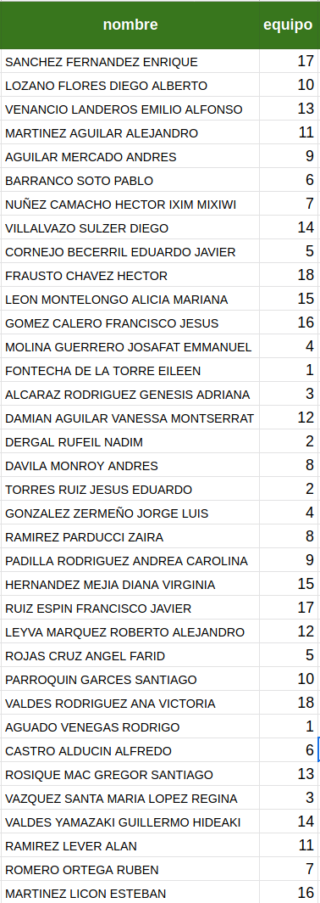

M. Sc. Liliana Millán Núñez liliana.millan@itam.mx

Noviembre 2020

### Proyecto 2

Cuentas con los datos de transacciones de una [panadería](https://www.dropbox.com/s/8qfwy2at0tcin1v/subset_bakery.csv?dl=0).

+ `Date` Fecha en la que se realizó la transacción.
+ `Time` Hora, minuto y segundo en el que se realizó la transacción.
+ `Transaction` Id de la transacción.
+ `Item` Producto que se compró en la transacción.

**Preguntas EDA**

1. ¿Cuál es el producto que más se vende?
2. Genera una gráfica de barras que contenga los 10 productos más populares ordenados de mayor a menor popularidad, donde popularidad es el conteo del número de transacciones en el que aparecieron.
3. ¿En qué día de los que tienes en tu *dataset* se compra más `Hot chocolate`?
4. Genera un histograma con el número de items que tienes por ticket, ¿cuántos items tienen la mayoría de los tickets?.
6. ¿Cuál es el ticket con mayor cantidad de productos, cuáles son esos productos?

Utilizando el algoritmo A-priori genera reglas de asociación a través de las transacciones con las que cuentas.

**Preguntas a-priori**

Ocupa un mínimo de soporte de **5%**.

7. ¿Cuáles son los 5 item con mayor soporte? ¿Cuánto tienen de soporte?

Generando reglas de asociación, ocupando un *threshold* mínimo de **30%** de confianza:

8. ¿Cuál es la regla de asociación con mayor confianza? Interpreta la confianza obtenida
9. ¿Cuál es la regla de asociación con menor confianza? Interpreta la confianza obtenida. ¿Qué estrategia recomiendas a negocio para aumentar la métrica de confianza?
10. Genera un *scatterplot* que tenga soporte en el eje `x` y confianza en el eje `y` coloreando por *lift*. ¿Cuál es la sección en la que deberíamos concentrarnos? Indica el mínimo de lift y mínimo de soporte. ¿Qué rango de porcentaje de confianza tienen esas reglas?

¿Cuándo se entrega?

+ El **miércoles 9 de diciembre a más tardar a las 23:59:59 CST** enviado a mi correo electrónico: liliana.millan@itam.mx con el subject `md_proyecto_2` solo 1 persona del equipo, con copia a la otro miembro del equipo.

¿Qué se entrega?

+ Enviar el `ipynb` que contiene el código, la salida y texto con explicación.

### Equipos

