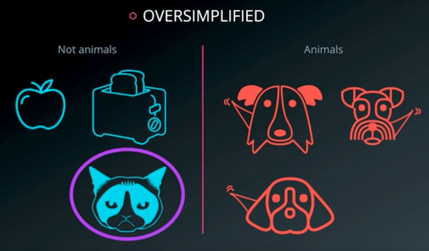
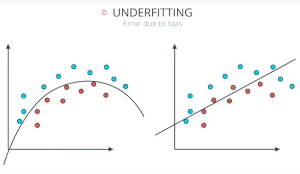
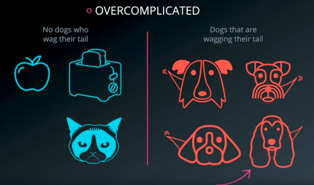
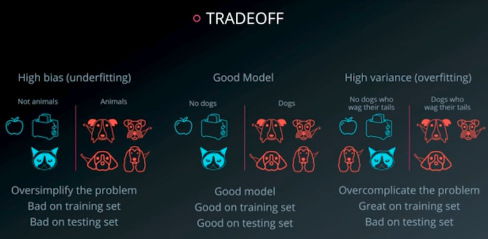
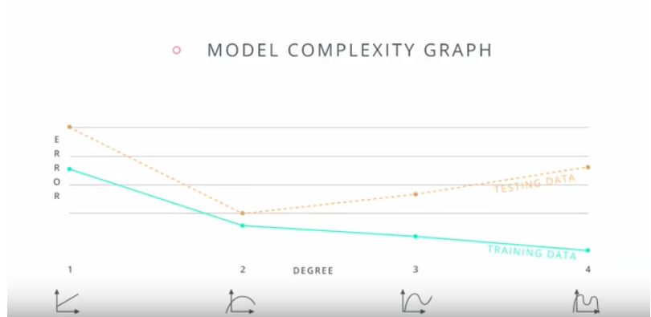
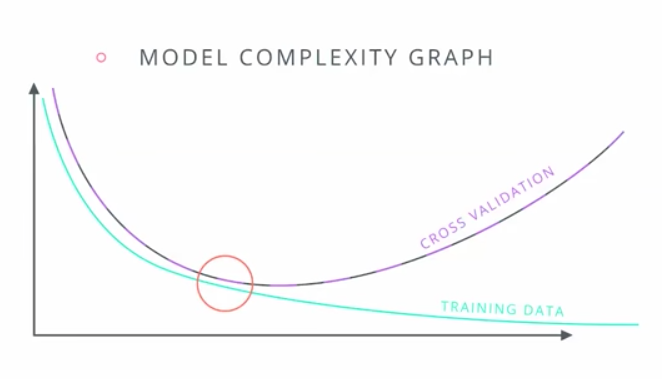

M. Sc. Liliana Millán Núñez liliana.millan@itam.mx

Septiembre 2020

### *Bias-Variance Tradeoff*

#### Agenda

+ *Underfitting*  
+ *Overfitting*
+ *Model Complexity graph*
+ *Data-Leaking*

***

Consiste en el *tradeoff* al que nos enfrentamos en cada modelo que hacemos para no hacer un sobreajuste -*overfit*- o un subajuste -*underfit*-.

#### *Underfitting*

+ El modelo es demasiado general.
+ Error debido al sesgo -*error due to bias*-.
+ Durante el entrenamiento no tiene un buen desempeño.

 
Fuente: Udacity nanodegree: Deep Learning

 
Fuente: Udacity nanodegree: Deep Learning

#### *Overfitting*

+ El modelo es muy particular.
+ Error debido a la varianza -*error due to variance*-.
+ Durante el entrenamiento tiene un desempeño muy bueno, pero al pasar nuevos datos su desempeño es malo.

 
Fuente: Udacity nanodegree: Deep Learning

 
Fuente: Udacity nanodegree: Deep Learning

#### *Model complexity graph*

Un buen modelo no es ni muy general ni muy especializado, se comporta bien en el entrenamiento, en los *sets* de validación -*cross validation* y en el *set* de pruebas.

Podemos ocupar una gráfica de complejidad de modelo -*model complexity graph*- en donde comparamos los errores obtenidos en el entrenamiento con los errores obtenidos en el *cross validation* para ver en qué espectro del *tradeoff* nos encontramos para el modelo que estamos construyendo. En el eje de las `y` pondremos los errores obtenidos para el entrenamiento y validación -una línea por cada uno- y en el eje de las `x` cada modelo entrenado de menor a mayor complejidad\*.

 
Fuente: Udacity nanodegree: Deep Learning

 
Fuente: Udacity nanodegree: Deep Learning

 
Fuente: Udacity nanodegree: Deep Learning
