M. Sc. Liliana Millán Núñez liliana.millan@itam.mx

Octubre 2020

### Agenda

+ Introducción
+ Algoritmo
+ Ejemplo a mano
+ Ejemplo `sklearn`

***
#### Introducción

Los árboles son uno de los métodos más ocupados en problemas de clasificación pues su implementación es muy sencilla y la salida son reglas que se pueden implementar como  `if/else` por lo que la interpretación es sumamente sencilla —a diferencia de una red neuronal—. Los árboles pueden tratar con datos categóricos y numéricos (C5.0, Ross Quinlan) otro de los puntos de su preferencia. También se pueden ocupar como primer modelo para selección de varaibles/características pues permite discriminar las variables que aportan más información al problema —lo mismo sucede con los *random forests*—.

Existen 4 tipos de algoritmos de árboles de decisión, los 3 desarrollados por Ross Quinlan:

+ **ID3** (Iterative Dichotomizer): Solo acepta datos categóricos, no puede manejar datos numéricos ni valores nulos.
+ **C4.5**: Acepta datos categóricos y  numéricos, puede manejar datos incompletos, agrega el procedimiento de *podado*
+ **C5.0**: Corre más rápido, requiere menos memoria y agrega *Boosting*, una técnica que genera y combina muchos clasificadores para mejorar el *accuracy* de las predicciones.
+ **CART**: Muy similiar a C4.5 ocupa árboles binarios.

 `sklearn` ocupa una implementación optimizada de CART, R ocupa una versión implementada del C5.0.

#### Elementos

Los árboles están formados por una **raíz** y muchas **ramas** hasta llegar a **hojas** —todos se conocen como nodos—.

La raíz es un nodo que se encuentra hasta arriba del árbol, las hojas son nodos que se encuentran en la parte baja del árbol, son nodos finales, y los diferentes caminos que van de la raíz a los diferentes nodos son las ramas.

En la raíz se pone la variable que separa mejor los datos de acuerdo a la variable que queremos predecir, los siguientes nodos tendrán las variables que van separando los datos de manera iterativa.

 

La forma en la que en un árbol se decide cómo se separan mejor los datos es a través de la entropía. Esta métrica mide qué tanta impureza hay en un nodo, donde la impureza tiene que ver con que los datos sean heterogéneos.

La entropía es una métrica que va entre 0 y 1 `[0,1]`, donde un valor de 0 corresponde a que todos los elementos en ese nodo son homogéneos, es decir, son iguales. En el contexto de clasificación, que sean iguales significa que todos tienen la misma categoría de la variable que queremos predecir, por lo que si por ejemplo, queremos predecir si una transacción bancaria es fraude o no, y en un nodo únicamente tenemos transacciones que son fraude, ese nodo tendrá una entropía 0 es decir, todos los datos son homogéneos.

Por otro lado, una entropía de 1, indica que los datos son heterogéneos, por lo que un nodo con entropía 1, indicaría que tenemos transacciones de fraude y de no fraude.

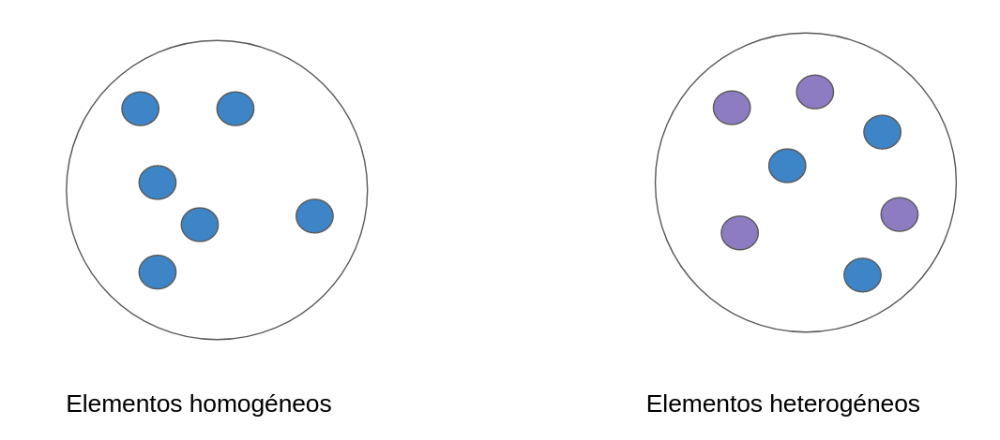

Para calcular la entropía de una variable binaria ocupamos la ecuación 1 que se muestra en la Figura 3. En donde la variable se define como un experimento bernoulli donde *p* es la probabilidad de éxito, y *q* la probabilidad de fallo.

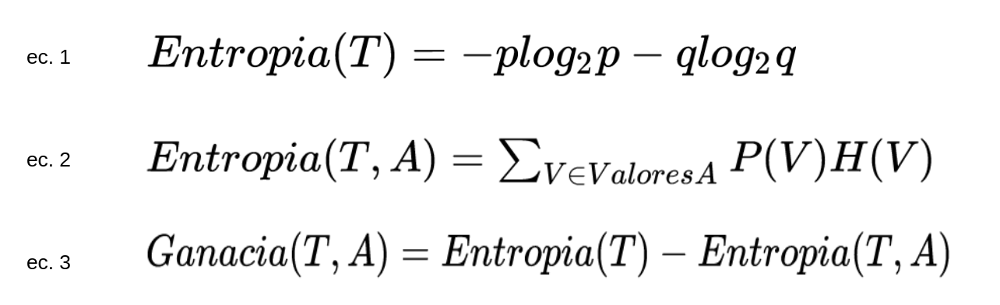
Figura 3

Para calcular la entropía de la variable *target* con respecto a una variable explicativa se ocupa la ecuación 2, en donde `ValoresA` se refiere a todos los posibles valores que puede tomar una variable explicativa categórica, y `V` se refiere a un valor específico de esa variable explicativa, por lo que `P(V)` se refiere a la probabilidad del valor `V` del atributo `A`.

Por último, para calcular la ganancia de información utilizando la entropía,se ocupa la ecuación 3, en donde restamos a la entropía de la variable *target* la entropía de la variable *target* causada por separarla utilizando la variable explicativa `A`.

#### Algoritmo

1. Obtener la entropía de la variable a clasificar —*target*—
2. Obtener la entropía de la variable a clasificar con respecto a una variable predictora
3. Obtener la ganancia de la variable seleccionada en el paso anterior
4. Repetir el paso 2 y 3 por cada variable predictora
5. Seleccionar la variable con mayor ganancia de información como el nodo raíz/decisión
6. Repetir los pasos 2 y 3 para el resto de las observaciones y variables cuya entropía es mayor a 0 hasta que la entropía sea 0 o bien, no haya más observaciones para dividir.
  + Si la entropía es 0, se trata de una hoja —todos los datos son homogéneos, no hay impureza—
  + Si la entropía es $>0$ aún se debe seguir dividiendo el *set*.

La condición de paro de este algoritmo consiste en que todas las variables logren tener una entropía de 0 o bien, que ya no haya más observaciones para poder seguir dividiendo.

Los nodos hoja necesariamente tendrán que surgir por alguna de estas dos condiciones.

#### Hiperparámetros

+ Profundidad del árbol
+ Número de elementos necesarios para seguir dividiendo
+ La métrica en la que se cuantifica la ganancia de información: Gini -índice de desigualdad- y Entropía. Por default la mayoría de los algoritmos ocupan gini.

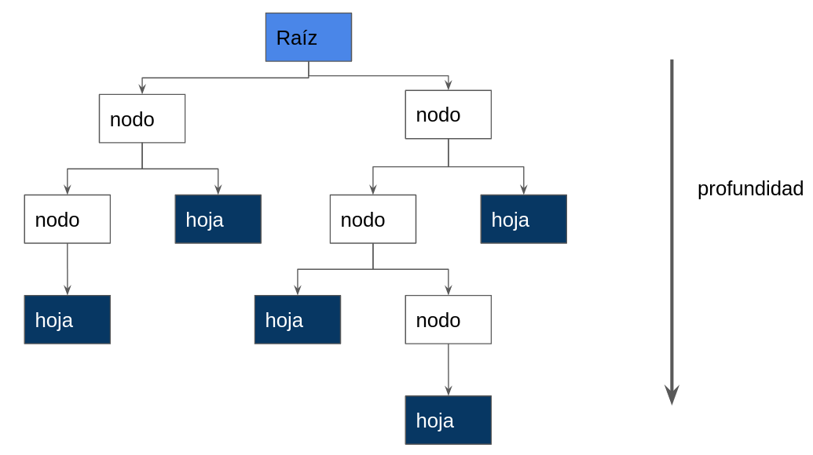

La sugerencia es que evites definir la profundidad del árbol, pues de esta manera estas restringiendo el crecimiento orgánico\*, se prefiere mejor definir el número de elementos que debe haber mínimo en un nodo para poder seguirse dividiendo. Si dejas que el árbol crezca sin limitar la profundidad es muy probable que hagas un modelo sobre ajustado, y por otro lado, si limitas la profundidad a ser muy pequeña, es muy probable que sub ajustes el modelo por lo que no generalizará correctamente los patrones en los datos.

Cuando ajustamos el crecimiento del árbol ya sea a través de definir la profundidad máxima o a través de definir el número de elementos mínimos para seguir dividiendo los datos estamos podando nuestro árbol o haciendo *pruning*.

#### Ejemplo manual

Tenemos los datos que se muestra en la Tabla 1,  con los que queremos predecir si dada la temperatura y la humedad del día jugaremos golf o no.

Este problema es un problema de aprendizaje supervisado de clasificación, donde la variable *target* es si `jugar golf` o `no jugar golf`, siendo la etiqueta positiva la etiqueta `jugar golf`, y la variable negativa la etiqueta `no jugar golf`.

Contamos con 10 observaciones en nuestro conjunto de datos para aprender los patrones entre la temperatura y la humedad para decidir si jugar golf o no.

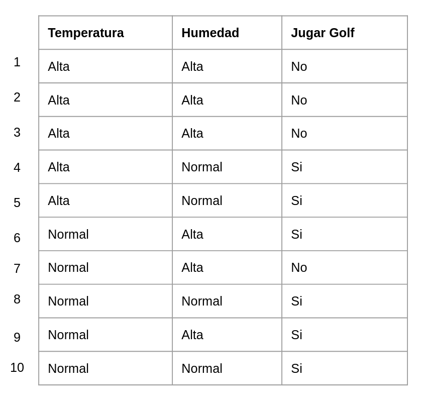
 
Tabla 1. Datos de ejemplo.

Iniciamos calculando la entropía de la variable *target*.

Formulando nuestra variable *target* como una variable bernoulli, nuestro éxito corresponde a jugar golf, y el fracaso a no jugar golf.

La probabilidad de jugar golf consiste en contar la frecuencia de jugar golf entre el número de observaciones totales de nuestro conjunto de datos, esto es 6 de 10 observaciones.  Mientras que la probabilidad de no jugar golf es de 4 de 10 observaciones.

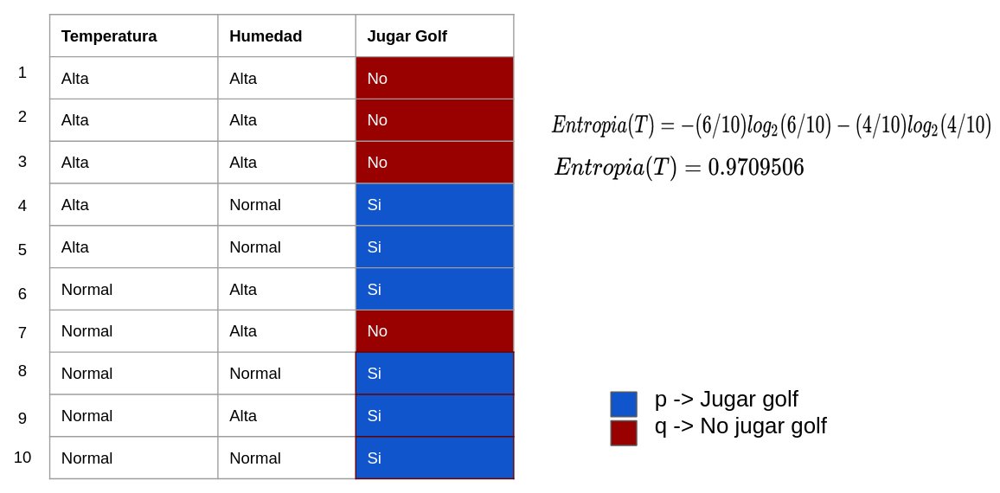
 
Figura 4. Paso 1. Cálculo de entropía de la variable *target*.

El siguiente paso consiste en obtener la entropía de nuestra variable *target* con respecto a una variable explicativa, no importa cual, pues revisaremos todas las variables explicativas. Iniciaremos con la variable `temperatura`.

 La variable `temperatura` tiene 2 valores diferentes: `alta` y `normal`, por lo que calcularemos la entropía para cada valor.

Para cuando la `temperatura` es `alta`, existen 5 observaciones, de las cuáles en 2 observaciones `jugamos golf` y en 3 `no`.

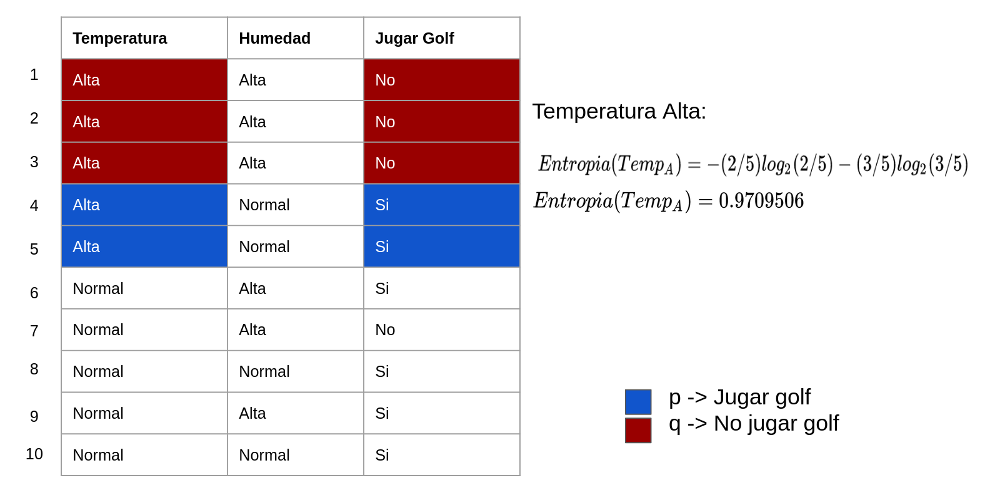
 
Figura 5. Cálculo de entropía para la variable `temperatura` con el valor `alta`.

Para cuando la `temperatura` es `normal`, existen 5 observaciones, en las cuales 4 `jugamos golf` y 1 `no`.

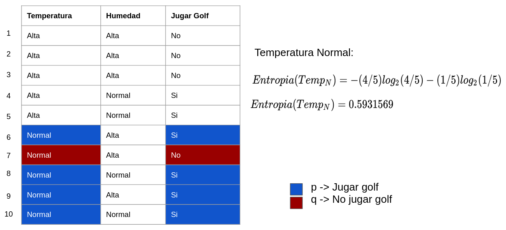
 
Figura 6. Cálculo de entropía para la variable `temperatura` con el valor `normal`.

La ganancia de información que obtenemos ocupando la temperatura para clasificar `jugar golf` o `no`.

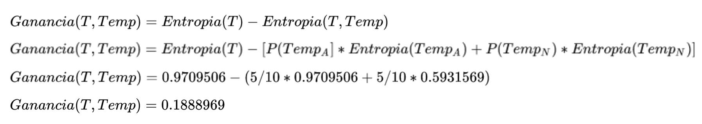
 
Figura 7. Cálculo de ganancia de información utilizando la variable `temperatura` para clasificar la variable *target*.

Haremos lo mismo que hicimos con la variable explicativa para la siguiente variable explicativa que tenemos, `humedad`.

 La variable `humedad` tiene 2 valores diferentes: `alta` y `normal`, por lo que calcularemos la entropía para cada valor.

Para cuando la `humedad` es `alta`, existen 6 observaciones, de las cuáles en 2 observaciones `jugamos golf` y en 4 `no`.

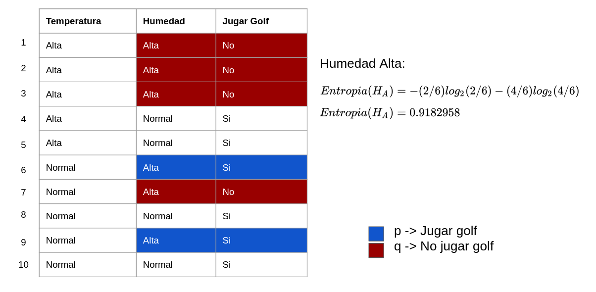
 
Figura 8. Cálculo de entropía para la variable `humedad` con valor `alta`.

Para cuando la `humedad` es `normal`, hay 4 observaciones de las cuales las 4 están asociadas a `jugar golf`.

Dado que todos los elementos de esta variable ya son iguales, es decir, todos tienen el mismo valor de la variable *target*, su entropía es 0, pues todo los elementos son homogéneos, como se muestra en la Figura 9.

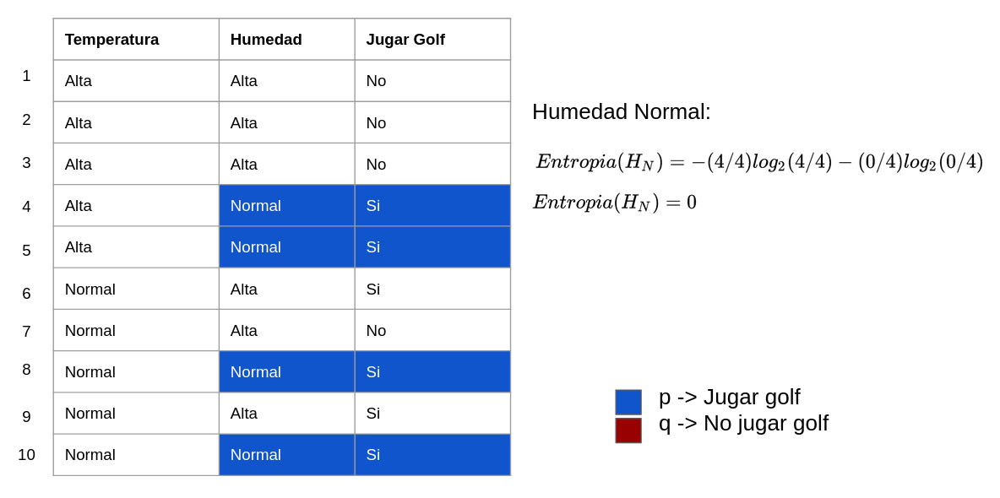
 
Figura 9. Cálculo de entropía de la variable `humedad` con valor `normal`.

Ahora calcularemos la ganancia de información como se muestra en la Figura 10.

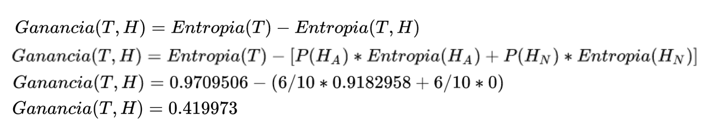
 
Figura 10. Cálculo de ganancia de información al utilizar la `humedad` como variable para clasificar la variable *target*.

Ahora que ya tenemos la entropía que aporta cada variable explicativa, deberemos seleccionar la que mayor ganancia de información tiene. En este caso, la `humedad`, por lo que esta variable se convierte en nuestro nodo raíz.

Dado que la `humedad` puede tomar dos valores, `normal` o `alta`, se generan dos nodos debajo del nodo raíz, uno para cuando la humedad es `normal`, y otro para cuando la `humedad` es `alta`.

También sabemos que en todos los casos en los que la `humedad` es `normal` la variable *target* toma el valor `jugar golf`, por lo que sabemos que su entropía es 0 y que todas las veces que la `humedad` sea `normal`, predicción será `jugar golf`. El árbol que generamos se puede ver en la Figura 11.

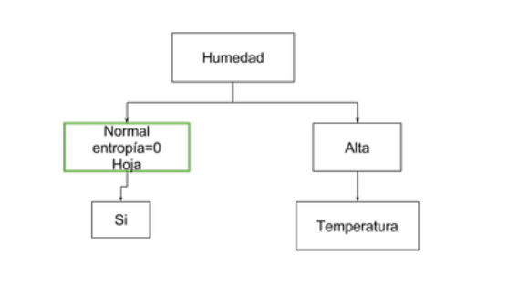
 
Figura 11. Selección de nodo y primer nivel.

Ahora calcularemos la entropía con el resto de las observaciones, esto es, cuando la `humedad` es `alta`.

Ahora el nuevo subconjunto de observaciones sobre las que realizaremos los cálculos de entropía serán sobre aquellas cuya `humedad` sea `alta` como se muestra en la Tabla 2.

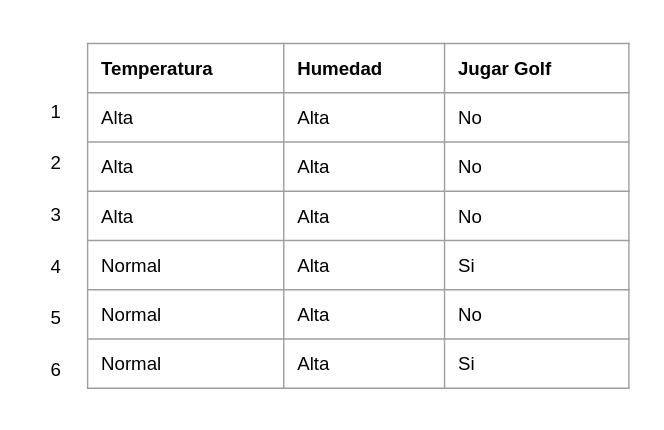
Tabla 2. Subconjunto de datos.

Regresamos al paso 2 para calcular la entropía con el resto de las variables explicativas con el nuevo subconjunto de observaciones, por lo que calcularemos la entropía con la `temperatura`.

Cuando la `temperatura` es `alta`, tenemos 3 observaciones, sin embargo, en todas las observaciones la variable *target* toma el valor de `no jugar golf`, por lo que al calcular la entropía, ésta se vuelve 0, porque todos los elementos de este subconjunto son homogéneos, es decir, tienen el mismo valor.

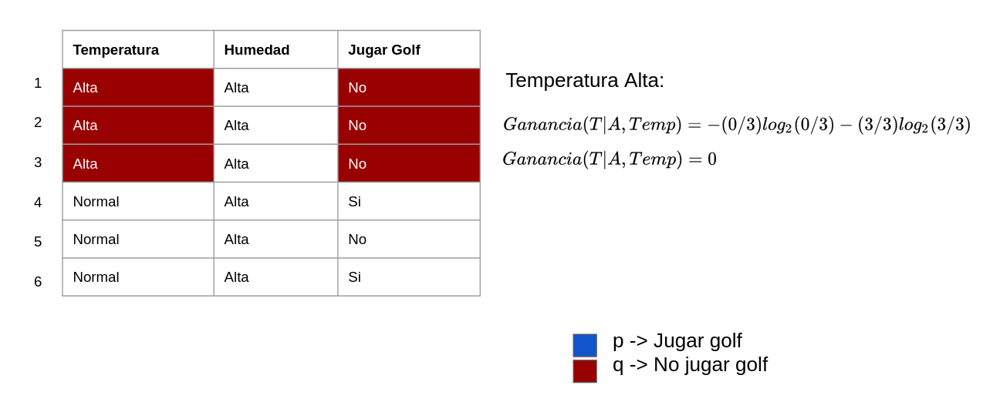
 
Figura 12. Cálculo de entropía con la variable `temperatura` y valor `alta`.

Dado que ya no tenemos más variables explicativas para verificar, podemos parar el algoritmo y ver el árbol generado que se muestra en la Figura 13.

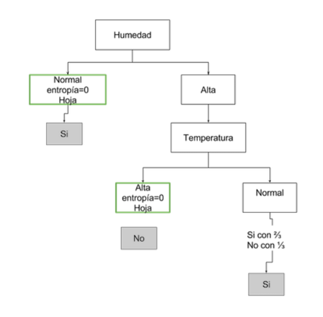
 
Figura 13. Árbol generado.

Cuando la `humedad` es `normal`, el árbol regresará como predicción `jugar golf`.

Si la `humedad` es `alta`, verificamos qué valor tiene la `temperatura`, si ésta es `alta`, el árbol regresará como predicción `no jugar golf`.

Por último, si la `humedad` es `alta`, y el valor de la `temperatura` es `normal` el árbol regresará como predicción `jugar golf`. La razón asociada a esta predicción es porque en el último paso que ejecutamos, en dos de las tres observaciones que tenían `temperatura` `normal`, la etiqueta *target* tenía el valor `jugar golf`.

**Ventajas**

+ Es muy fácil de implementar e interpretar.
+ Se pueden ocupar tanto variables explicativas numéricas como variables explicativas categóricas.
+ Se pueden visualizar las reglas del árbol.

**Desventajas**

+ Dependiendo de qué variables explicativas incluyas en tu modelo, el árbol puede dar resultados muy diferentes.
+ Es fácil sobre ajustar el modelo al dejarlo crecer en profundidad sin hacer *pruning*.
+ Definir los hiperparámetros para la profundidad y el número de elementos que un nodo debe tener para ser considerado hoja, dependen de la experiencia del que desarrolla el modelo y del problema en particular.

Ahora veremos cómo implementar un árbol en `scikit-learn`.

 Ir a notebook `classification_trees.ipynb`.
