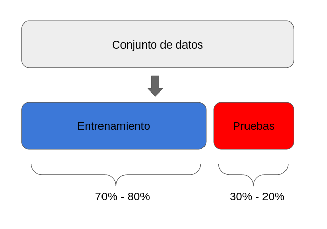
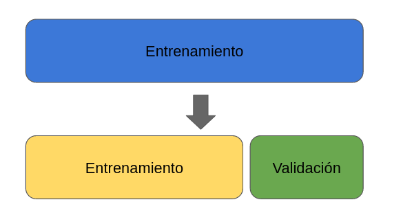

M. Sc. Liliana Millán Núñez liliana.millan@itam.mx

Octubre 2020

### Clasificación

#### Agenda

+ Clasificación
+ Métricas de Desempeño

----
####  Clasificación

#### Métricas de desempeño

Debido a que contamos con la respuesta correcta podemos contar cuántos aciertos tuvimos y cuántos fallos tuvimos.

Por simplicidad ocuparemos un ejemplo de clasificación binaria: Fraude (1) o No fraude (0).

En este tipo de algoritmos definimos cuál de las categorías será nuestra etiqueta positiva y cuál será la negativa. La positiva será la categoría que queremos predecir -en nuestro ejemplo, fraude- y la negativa lo opuesto -en el caso binario- en nuestro ejemplo, no fraude.

Dadas estas definiciones tenemos 4 posibilidades de *outcome*:

1. **True positives:** Nuestra predicción dijo que la transacción es fraude y la etiqueta real dice que es fradue.
2. **False positives:** Nuestra predicción dijo que la transacción es fraude y la etiqueta real dice que no es fraude.
3. **True negatives:** Nuestra predicción dijo que la transacción es no fraude y la etiqueta real dice que no es fraude.
4. **False negatvies:** Nuestra predicción dijo que la transacción es no fraude y la etiqueta real dice que es fraude.

##### AUC y ROC:

*Area Under the Curve* y *Receiver operator characteristic*

 

 

 

 

##### Matriz de confusión

Esta métrica corresponde a una matriz en donde se plasma el conteo de los aciertos y los errores que haya hecho el modelo.

En esta métrica utilizamos todos los aciertos y todos los errores que haya tenido el modelo en las predicciones, esto es: los verdaderos positivos (TP), los verdaderos negativos (TN), los falsos positivos (FP) y los falsos negativos (FN).

El nombre de la métrica está asociado a que puede ser confuso leer e interpretar correctamente la información que nos presenta.

Normalmente los renglones representan las etiquetas reales, ya sean positivas o negativas, y las columnas, las etiquetas predichas.

No te preocupes si es algo confuso en este momento, veremos cada elemento por separado para que queden claros los elementos y cómo leerlos.

 

Puedes ver en la siguiente matriz, que la primera columna tiene el nombre Real, y que, el primer renglón dice “Etiquetas positivas”, y el segundo renglón dice “Etiquetas negativas”.

 

La primera columna tiene el nombre “Predicción”, y la segunda columna dice “Etiqueta positivas”, y que la segunda columna dice “Etiqueta negativas”.

 

Cada celda en la matriz incluye la información correspondiente a las etiquetas reales y a las etiquetas predichas por el modelo.

En la celda donde las etiquetas reales son positivas y las etiquetas predichas son positivas se encuentra el conteo de los verdaderos positivos del modelo. Esto es, el número de observaciones en donde el modelo dio una predicción de etiqueta positiva y efectivamente la etiqueta real era positiva.

De la misma manera siguiendo esta diagonal, la celda donde las etiquetas reales son negativas y las etiquetas predichas son negativas se encuentra el conteo de los verdaderos negativos del modelo. Esto es, el número de observaciones en donde el modelo dio una predicción de etiqueta negativa y efectivamente la etiqueta real era negativa.

En la diagonal de la matriz de confusión siempre se encuentran los aciertos del modelo, tanto los verdaderos positivos como los verdaderos negativos.

 

Ahora, moviéndonos a la celda en donde las etiquetas reales son negativas y las predicciones del modelo son etiquetas positivas, encontramos los falsos positivos. Esto es, el número de observaciones en donde el modelo dio una predicción de etiqueta positiva pero la etiqueta real era una etiqueta negativa.

 

Por último, la celda en donde las etiquetas reales son positivas y las predicciones del modelo son etiquetas negativas, encontramos los falsos negativos. Esto es, el número de observaciones en donde el modelo dio una predicción de etiqueta negativa pero la etiqueta real era una etiqueta positiva.

Veamos un ejemplo de cómo leer una matriz de confusión.

 

En la siguiente matriz de confusión se puede ver:

+ Que el modelo tiene 125 aciertos en verdaderos positivos, esto es, observaciones cuya etiqueta real era positiva y el modelo predijo correctamente con etiqueta positiva.
+ Que el modelo tiene 233 aciertos en verdaderos negativos, esto es, observaciones cuya etiqueta real era negativa y el modelo predijo correctamente con etiqueta negativa.
+ Que el modelo tiene 46 falsos positivos, esto es, observaciones cuya etiqueta real era negativa y el modelo predijo erróneamente con etiqueta positiva.
+ Que el modelo tiene 20 falsos negativos, esto es, observaciones cuya etiqueta real era positiva y el modelo predijo erróneamente con etiqueta negativa.
+ Que el modelo tiene 358 aciertos totales, entre verdaderos positivos y verdaderos negativos.
+ Que el modelo tiene 66 errores totales de predicción, entre falsos positivos y falsos negativos.
+ Que el modelo tiene un mejor desempeño para predecir la etiqueta negativa que la positiva.
+ Que el modelo comete menos errores en las etiquetas negativas.

 

También es posible que una matriz de confusión tenga las columnas como las etiquetas reales y los renglones como las etiquetas predichas por el modelo.

En este caso lo único que cambia es que los falsos negativos y los falsos negativos intercambian lugares. Esto es, ahora debajo de los verdaderos positivos están los falsos negativos, y junto a los verdaderos positivos están los falsos positivos.

Claro que también puedes invertir el orden de las etiquetas y poner primero las negativas y luego las positivas.

Lo más importante será que la matriz de confusión siempre tenga los títulos de qué es predicho y que es la etiqueta real para poder interpretar correctamente los valores que se presentan en ella.

 

 ¿Cuándo utilizar la matriz de confusión?

Siempre deberás de obtener tu matriz de confusión para el punto de corte que selecciones en la métrica de desempeño de curva ROC, que vermos más adelante.

Toma en cuenta que es necesario agregar esta métrica en la entrega de tu modelo.

 
Fuente: [Scikit learn Confusion Matrix](https://scikit-learn.org/stable/modules/model_evaluation.html#confusion-matrix)

 
Fuente: [Scikit yellowbrick](https://www.scikit-yb.org/en/latest/api/classifier/confusion_matrix.html)

#### *Accuracy*

Número de aciertos totales entre todas las predicciones.

 

+ La métrica más socorrida -malamente-
+ En *datasets* imbalanceados esta métrica no nos sirve, al contrario, nos engaña. Por ejemplo: Fraude con tarjeta de crédito.

##### *Precision* :: Eficiencia

De los que identificamos como clase positiva, cuántos identificamos correctamente. ¿Qué tan eficientes somos en la predicción?

 

##### *Recall* :: Cobertura

Del universo posible de nuestra clase positiva, cuántos identificamos correctamente.

*Precision* y *Recall*

 

El precision medirá la eficiencia del modelo en la predicción de las etiquetas positivas, en este caso los círculos azules. En este caso, los 3 círculos amarillos con contorno negro corresponden a los falsos positivos, observaciones que fueron predichas como etiqueta positiva pero que en realidad eran etiqueta negativa. Para obtener el precision de este modelo, necesitamos contar los círculos azules y dividirlos entre la suma de los círculos azules y los círculos amarillos con contorno azul -predichos como azul, pero en realidad eran amarillos-.

Por otro lado, el recall medirá la cobertura de nuestro modelo, es decir, qué tantos círculos azules de todos los posibles círculos azules el modelo predijo correctamente. En este caso, los 4 círculos azules con contorno amarillo corresponden a falsos negativos, observaciones que fueron predichas como etiqueta negativa pero realmente eran etiqueta positiva. Para obtener el recall de este modelo, necesitamos contar los círculos azules y dividirlos entre la suma de los círculos azules y los círculos azules con contorno amarillo -predichos como amarillos, pero en realidad eran azules-.

En este caso en particular, tenemos una mejor eficiencia o precision que cobertura o recall , de 0.77 y 0.71 respectivamente. Esto significa que el modelo se equivoca poco cuando predice que una observación es etiqueta positiva, pero que sin embargo, se le escapan algunas etiquetas positivas y las predice como negativas -menor recall-.

 ¿Cuándo utilizar precision?

Esta es la métrica que ocuparás más, pues en un contexto de negocio, donde los recursos son finitos y tiene un costo asociado, ya sea monetario o de tiempo o de recursos, necesitarás que las predicciones de tu etiqueta positiva sean muy eficientes.

Al utilizar esta métrica estaremos optimizando el modelo para minimizar el número de falsos positivos.

 ¿Cuándo utilizar recall?

Esta métrica la ocuparás cuando en el contexto de negocio de tu problema sea más conveniente minimizar los falsos negativos por el impacto que estos pueden tener en las personas en quienes se implementará la predicción. Por ejemplo, predecir si se tiene cáncer o no al ver una imágen de resonancia magnética. En este modelo quisiéramos optimizar para que cuando decimos que la mayoría de los casos que haya cáncer el modelo haga una predicción de etiqueta positiva, y que se nos escapen la menor cantidad de casos, ya que por cada error al decir que no se tiene cáncer estamos negando a una persona un tratamiento que pueda curar su cáncer, lo que puede llevar a matar a alguien al equivocarnos diciendo que no tenía cáncer cuando sí lo tenía.   

Al utilizar esta métrica estaremos optimizando el modelo para minimizar el número de falsos negativos.

#### *Precision Recall curve*

 
Fuente: [Scikit-learn](https://scikit-learn.org/stable/auto_examples/model_selection/plot_precision_recall.html#sphx-glr-auto-examples-model-selection-plot-precision-recall-py)

 
Fuente: Kasun Amarasinghe

#### **F1-score:**

Combina *precision* y *recall* para optimizar ambos.

 

 ¿Cuándo utilizar la métrica f1-score?

Se recomienda utilizar esta métrica de desempeño cuando quieres balancear tanto los falsos positivos como los falsos negativos. Aunque es una buena solución para tomar en cuenta ambos errores, pocas veces hay problemas reales que permiten ocuparla, esto es porque en más del 90% de los casos tenemos una restricción en recursos.

### Procedimiento

