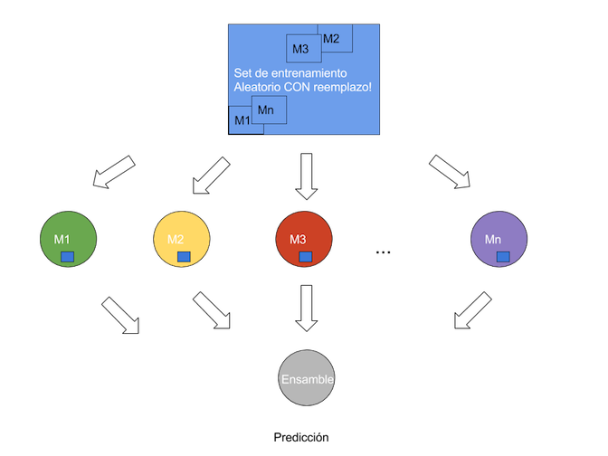
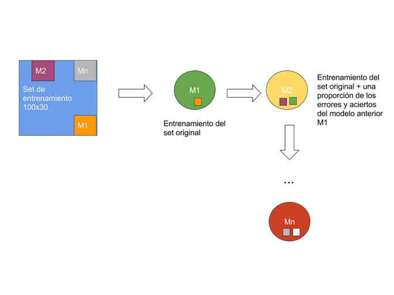
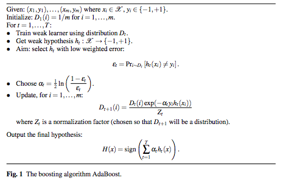
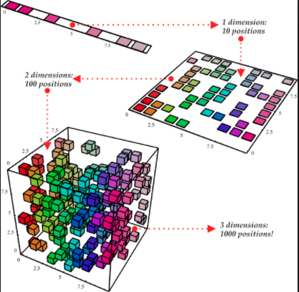
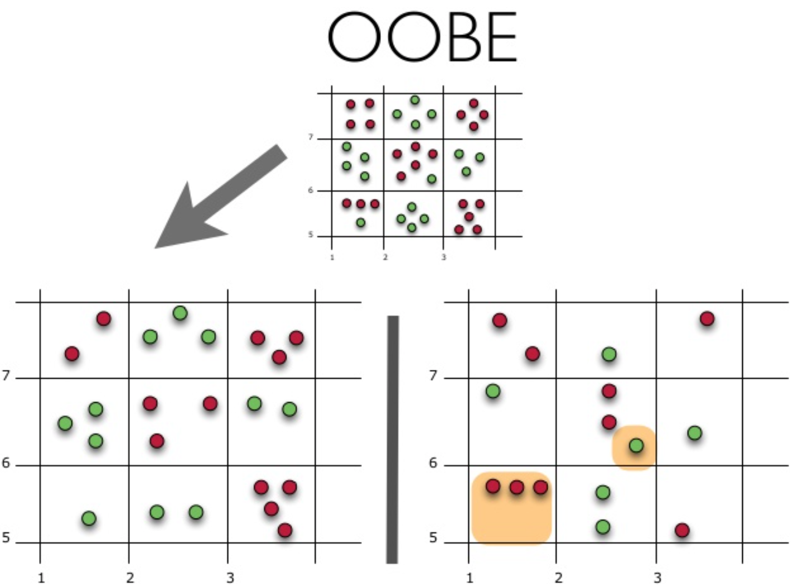

M. Sc. Liliana Millán Núñez liliana.millan@itam.mx

Noviembre 2020

### Random Forest

### Agenda

+ Modelos de Ensamble
  + Bagging
  + Boosting
+ Maldición de la dimensionalidad
+ Random Forest
    + Ventajas y desventajas
    + Algoritmo
+ Ejemplo

### Modelos de ensamble

Son aquellos en los que ocupamos **diversos** modelos para combinarlos y formar uno más fuerte. La diversidad es muy importante ya que permite que cada modelo vea un aspecto diferente de los mismos datos y baje la varianza. La diversidad puede venir de tener un mismo experimento diferentes datos de entrenamiento y pruebas, diferentes experimentos con el mismo algoritmo -modificando los hiperparámetros del modelo-, o bien, diferentes algoritmos :).

+ *Bagging (bootstrap aggregating)*: Tomamos diferentes muestras aleatorias de los datos CON reemplazo, suponemos que las diferencias en las muestras generadas con *bootstrap* llevaran a tener modelos diferentes, la  predicción final se obtiene combinando el resultado de todos los modelos creados. Por otro lado, para seguir fomentando diversidad se seleccionan aleatoriamente las variables que forman parte de cada modelo —*subspace sampling*—. Ejemplo de este método de ensamble son los Random Forest.

+ *Boosting*: Otro método de ensamble, aquí se hacen muestras aleatorias de los datos SIN reemplazo formando modelos *débiles* secuenciales con cada muestra, por cada modelo generado se ocupan los errores del anterior para mejorar la salida. Ejemplo de este método de ensamble es AdaBoost.

 

 
Fuente: [Rober E. Schapire](http://rob.schapire.net/papers/explaining-adaboost.pdf)

$\rightarrow$ En humano: Se ocupa una función de costo exponencial a través de la cual establecemos un costo a las clasificaciones incorrectas, cada vez que se genera un nuevo modelo el peso de los mal clasificados se vuelve más grande que los clasificados correctamente.

### Maldición de la dimensionalidad

Conforme más variables tenemos en un *set* de datos más observaciones se requieren para poder tener un número significativo de ejemplos con todas las combinaciones posibles. Esto resulta casi imposible, pues conforme se agregan variables el número de ejemplos requeridos crece exponencialmente. Si no se tienen los ejemplos suficientes, se corre el riesgo de que el modelo generado esté sobre entrenado -*overfitted*-.

 
Fuente [Haifeng Li](https://haifengl.wordpress.com/2016/02/29/there-is-no-big-data-in-machine-learning/)

 

Normalmente en un problema de minería de datos/ciencia de datos ocurre que hay muchas variables a tomar en cuenta para armar un modelo final que nos ayude a resolver el problema de negocio específico. Si bien, es posible incluir todas las variables en los modelos (aunque la mayoría de las veces no resulta tan adecuado por la maldición de la dimensionalidad), también es posible identificar las variables que más información nos dan antes de incluirlas en el modelo final, al igual que es posible generar nuevas variables derivadas de los datos originales que guardan la información más relevante al problema.

La primera opción —identificar variables que más información aportan— es conocida como *feature selection*, la segunda opción —generar nuevas variables derivadas de los datos originales— se le conoce como *feature extraction*. Ambas opciones forman parte del proceso llamado *feature engineering* dentro de un proyecto de ciencia de datos.

+ Algunos métodos de *feature selection*: Árboles, Random Forests, Regresión lineal (con regulariación Lasso).

+ Algunos métodos de *feature extraction*: PCA, SVD, Redes Neuronales Convolucionales (CNN).

### Random Forest

Es un modelo de ensamble creado por [Leo Breiman](https://www.stat.berkeley.edu/~breiman/RandomForests/cc_home.htm#remarks) en donde los diferentes modelos son árboles y son diversos debido a que ocupan *bagging* para su formación. Cuando los *random forests* se ocupan para clasificación se hace un **voto de expertos** —ponderados, mayoría, etc— para el caso de regresión se hace con el promedio —ponderado, simple—.

#### Parámetros

+ Número de árboles en el bosque.
+ Número de variables que habrá en cada árbol
  + La selección de las variables se hace de manera aleatoria para compensar las diferencias que se pueden obtener al poner ciertas variables juntas en un árbol o no.
+ Profundiad de los árboles. Esta definición se respetará para todos los árboles!
+ Número mínimo de elementos en los nodos antes de seguir dividiendo el set de datos -cuántos elementos para ser hoja-.

#### Ventajas y desventajas

+ Al utilizar *bagging* reduce la varianza y evita el *overfitting*
+ Permite hacer selección de variables para construir un segundo modelo utilizando las variables seleccionadas.

#### Métricas de desempeño

Además de las que ya hemos visto con los árboles, en los *random forest* existe la métrica *Out Of Bag (OOB)* que nos brinda información importante.

+ OOB: Corresponde al error promedio de predicción en cada set de entrenamiento $x_i$, medido únicamente con los árboles que **no** tuvieron a estas observaciones en su entrenamiento, como si fueran observaciones nuevas. Es como si estuvieramos haciendo pequeños *sets* de prueba con observaciones que los árboles no vieron durante su entrenamiento. Si el OOB es alto significa que los árboles están subentrenados -underfitting-, mientras que si el error es bajo, estamos generalizando adecuadamente.

Debido a que RandomForest utiliza bagging como métrica de muestreo para entrenar cada árbol que forma parte del bosque, es posible hacer un tipo de validación cruzada verificando cómo es la predicción de una observación utilizando únicamente árboles en donde esa observación no se utilizó para el entrenamiento.

En cada muestra creada para cada árbol queda alrededor de un 37% de observaciones fuera, de ahí el nombre Out Of Bag, y RandomForest utiliza este 37% como conjunto de validación extra de todos los árboles, de esta manera Out of Bag realiza una especie de validación cruzada propia, y es mejor ocupar esta métrica de desempeño del Random Forest para ver qué tan bien generaliza el modelo.

En la imagen se muestra un conjunto de datos que después se divide en entrenamiento y pruebas, el entrenamiento se encuentra en la parte izquierda, y en el conjunto de pruebas se encuentran aquellas observaciones que no se ocuparon en cada modelo.

 
Fuente: https://medium.com/open-machine-learning-course/open-machine-learning-course-topic-5-ensembles-of-algorithms-and-random-forest-8e05246cbba7

En los RF no necesitamos hacer *cross validation*, ¿por qué?.

En cada árbol construido la muestra generada por *bootstrap* deja fuera 1/3 de los datos, para obtener la métrica de OOB.

 ¿Qué sucede mientras más árboles pones en un Random Forest?
