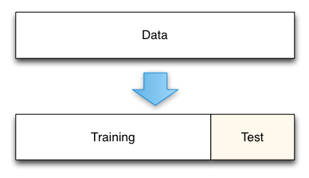
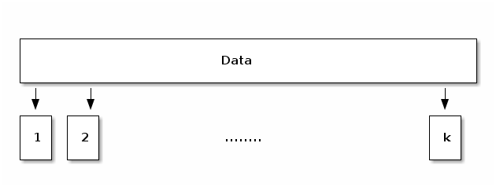
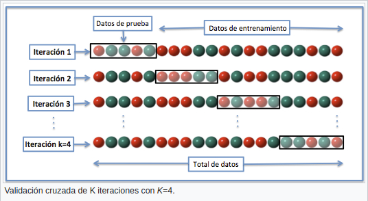
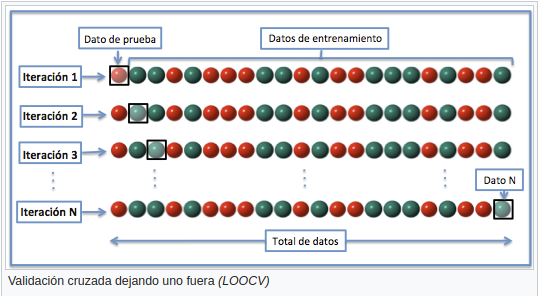
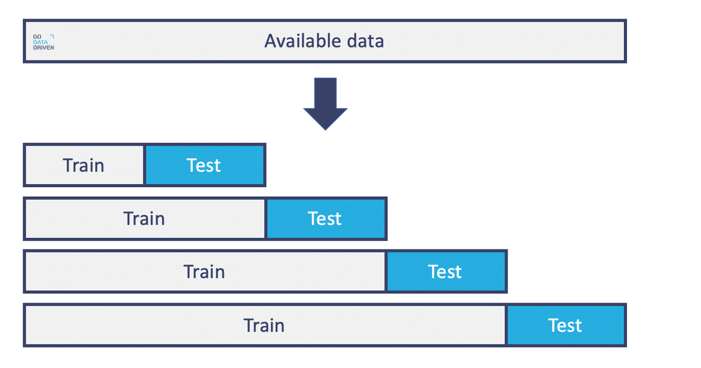
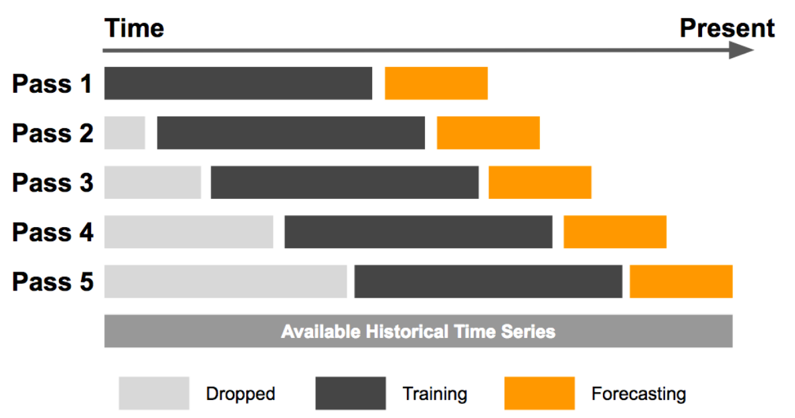

M. Sc. Liliana Millán Núñez liliana.millan@itam.mx

Octubre 2020

### **Cross-validation**

#### Agenda

+ *Hold out Validation*
+ *Cross validation*
  + *K-fold*
  + *Leave one out*
  + *Temporal*

****

En ML, para evitar hacer sobreajuste a los modelos, partimos el conjunto de datos de entrenamiento en varios pequeños *sets* que iremos alternando como *set* de pruebas.  

#### Hold out Validation

La forma más sencilla e incorrecta.

 
Fuente: [Data splitting - Include Help](https://www.includehelp.com/ml-ai/data-splitting.aspx)

##### Cross Validation

+ Es un método estadístico que nos permite **evaluar** qué tan bien generaliza un modelo -a través de su desempeño-.
+ Existen muchas variantes, la más común es **k-fold cross validation**.

**K-fold cross validation**

+ Partimos nuestro set de entrenamiento en *k* sets -mínimo 5, normalmente 10-.
+ Apartaremos uno de estos *k* sets para ocuparlo como nuestro *set* de pruebas y el resto *k-1* como entrenamiento.
+ Cambiaremos de *set* de pruebas *k* veces.
+ El desempeño del modelo se toma como el **promedio** del desempeño de las *k* pruebas.
+ La selección de los datos que forman parte de los *k-folds* se escoge de manera aleatoria.

 

 
Fuente: [Cross validation (Statistic) Wikipedia](https://en.wikipedia.org/wiki/Cross-validation_\(statistics\))

**Leave One Out CV**

+ Un extremo del *K-fold CV* consiste en hacer *k* una observación, en este caso tendremos un *k=n* donde *n* es el núnmero de observaciones totales de nuestro *set* de entrenamiento.

 
Fuente: [Cross validation (Statistic) Wikipedia](https://en.wikipedia.org/wiki/Cross-validation_\(statistics\))

#### Temporal Cross Validation

Cuando nuestros datos tienen temporalidad, no podemos hacer el *spliting* en set de entrenamiento y set de pruebas de manera aleatorio, ni **tampoco** podemos ocupar CV normal.

 ¿Por qué?

En estos casos necesitamos respetar el tiempo y la secuencia en la que las observaciones se ocurrieron en la realidad. En este caso nuestro *split* debe ser de acuerdo al tiempo. Por ejemplo: Si contamos con datos de enero 2019 a octubre 2019 podemos partir el set en:

+ Entrenamiento: Enero 2019 a Agosto 2019
+ Pruebas: Septiembre 2019 a Octubre 2019

 ¿Puedes identificar algo "raro"?

Y el **temporal cross validation** debe realizarse sobre el *set* de entrenamiento **respetando** la temporalidad, aquí **no** podemos escoger las observaciones de cada *k-fold* de forma aleatoria. Es decir, un *k* puede ser febrero y entrenamos con enero, luego el siguiente *k* puede ser marzo y entrenamos con enero y febrero, etc.

 
Fuente: [Go Data Driven](https://blog.godatadriven.com/time-series-nested-cv)

Otra configuración puede ser mantener el tamaño de la ventana de entrenamiento del mismo tamaño conforme avanzamos en el CV. Esto hace que las comparaciones entre *fold* sean más equitativas.

 
Fuente: [Uber engineering](https://blog.godatadriven.com/time-series-nested-cv)
