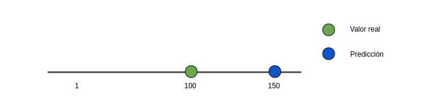
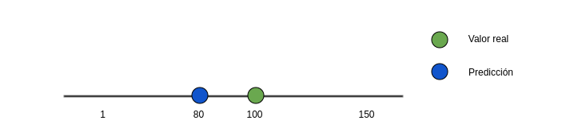
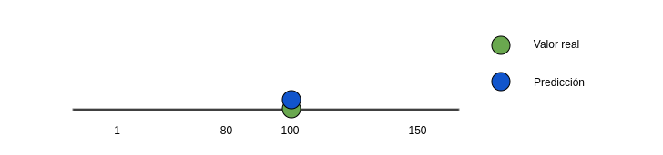
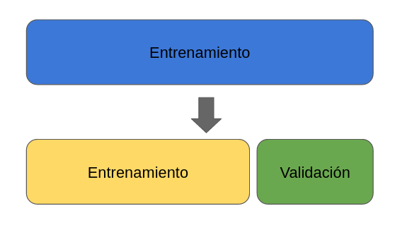
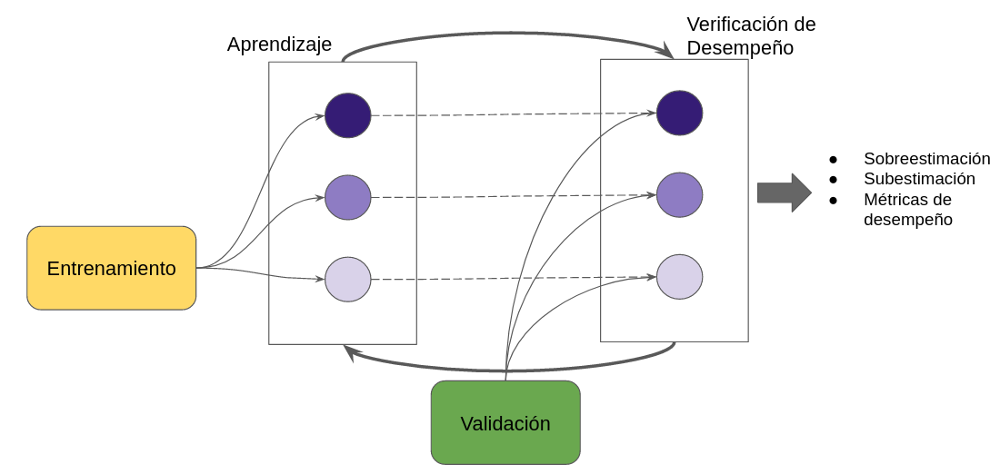
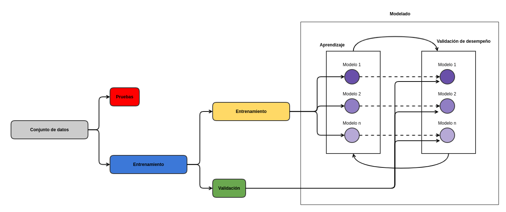
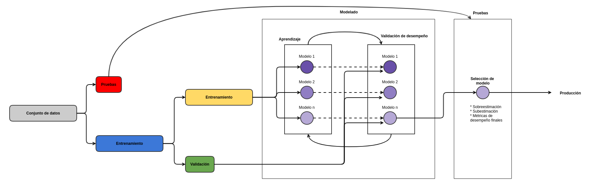
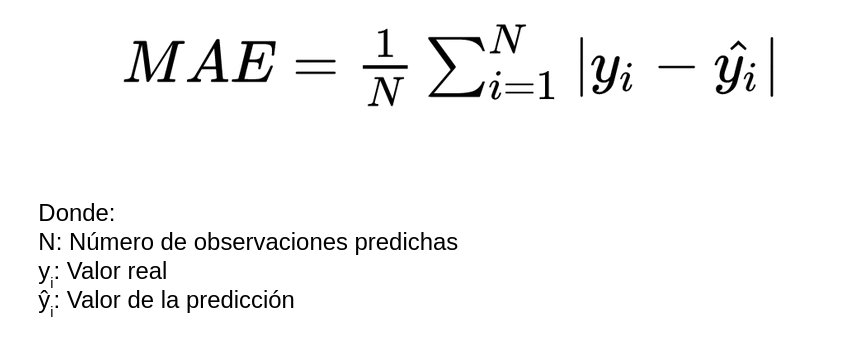
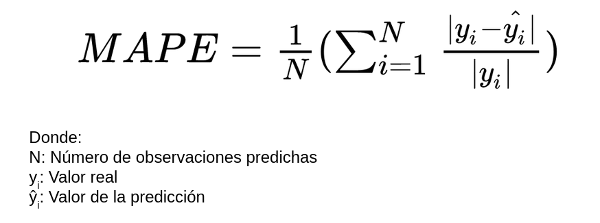
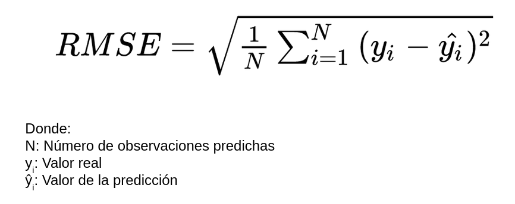

## Regresión

M. Sc. Liliana Millán Núñez, liliana.millan@itam.mx

### Agenda

+ Regresión
+ Métricas de desempeño
+ Regresión Lineal

----

### Regresión

En un problema de regresión, la variable target o variable a predecir es un valor numérico.

Dado que lo que queremos predecir es un número, existen 3 posibles escenarios para la predicción:

1. Nuestra predicción fue mayor al número real -*overestimate*-.
2. Nuestra predicción fue menor al número real -*underestimate*-.
3. Nuestra predicción fue igual al número real.

En el primer escenario, el valor predicho por el modelo es más grande que el valor real.

Este caso se llama sobreestimación, pues nuestra predicción quedó larga, es decir, fue mayor al valor real.

 

Dependiendo del problema y el contexto de negocio donde éste se desarrolla, puede ser que una sobreestimación sea más costosa que una subestimación. Cuando hablamos de costo, no solo nos referimos al costo monetario sino de cualquier recurso necesario en las acciones que se requieren de llevar a cabo una vez que se genera una predicción.

En el segundo escenario, el valor predicho por el modelo es más pequeño que el valor real.

Este caso se llama subestimación, pues nuestra predicción quedó corta, es decir, fue menor al valor real.

 

Al igual que con la sobreestimación, dependiendo del problema y el contexto de negocio donde éste se desarrolla, puede ser que una subestimación sea más costosa que una sobreestimación.

En el tercer escenario, la predicción del modelo es exactamente igual al valor real.

En problemas de regresión es muy difícil tener una estimación exacta, ya que la mayoría de las veces los valores a estimar son números reales que incluyen dos, cuatro o hasta seis valores decimales.

 

Dado que al ser un problema de aprendizaje supervisado contamos con un conjunto de datos histórico a través del cual vamos a aprender los patrones que queremos predecir, se sigue un procedimiento particular para ocupar estos datos durante la fase de aprendizaje y generalización de los modelos que desarrollamos.

#### Procedimiento

El procedimiento que veremos a continuación, se ocupa en todos los problemas de aprendizaje supervisado de regresión, sin importar el algoritmo a utilizar.

En los modelos de aprendizaje supervisado siempre contamos con ejemplos de los cuales aprendemos cuál es la respuesta correcta. Esta serie de ejemplos corresponden a transacciones históricas reales que contienen el valor que queremos estimar, a la cual llamamos conjunto de datos.

Para poder entrenar nuestros modelos de regresión, necesitaremos dividir el conjunto de datos histórico en un conjunto de entrenamiento y uno de pruebas.

El conjunto de entrenamiento debe de tener entre un 70% y 80% de las transacciones del conjunto de datos, mientras que el conjunto de pruebas contiene entre el 30% y el 20% de las transacciones del conjunto de datos.

Los datos que forman parte del conjunto de entrenamiento no pueden formar parte del conjunto de pruebas, así como los datos que forman parte del conjunto de pruebas no pueden formar parte del conjunto de entrenamiento.

 

Una vez que tenemos divididos los datos en el conjunto de entrenamiento y pruebas, **deberemos olvidar** que existe un conjunto de datos de pruebas. A partir de este punto para nosotros **no existe** el conjunto de pruebas.

El conjunto de pruebas **no** debe ser ocupado sino hasta que hemos seleccionado el mejor de todos los modelos entrenados, de no hacerlo así, caeremos en el error común de sobre-ajustar -*data leaking*- los modelos al permitirle ver observaciones que no debe conocer.

#### Entrenamiento

Por otro lado, del conjunto de entrenamiento obtendremos varios conjuntos de validación que nos servirán para ir midiendo el desempeño del modelo cuando movemos sus hiper-parámetros.

 

Ahora que ya tenemos un conjunto de entrenamiento y validación, ya podemos iniciar con el entrenamiento de nuestros modelos de regresión.

#### Modelación

Para entrenar nuestros modelos, deberemos ocupar el conjunto de datos de entrenamiento, y para realizar predicciones con las que mediremos el desempeño del modelo utilizaremos el conjunto de validación.

Nunca debemos ocupar el conjunto de datos que utilizamos en la fase de entrenamiento de un modelo como conjunto de datos a predecir para verificar el desempeño del mismo, siempre tienen que ser conjuntos de datos diferentes.

Si el desempeño del modelo no es el adecuado, modificamos los hiper-parámetros del modelo, o agregamos nuevas variables predictoras y volvemos a pasar el conjunto de datos de entrenamiento.

Más adelante veremos métodos de validación cruzada que nos ayudarán a evitar sobre-ajustar el modelo.

 

Con base en el desempeño que tienen los diferentes modelos desarrollados, seleccionamos el que cumple de manera más eficiente con los objetivos del proyecto, tanto operativamente como en las métricas de desempeño específicas.

Una vez que seleccionamos el modelo con el mejor desempeño entonces ocupamos el conjunto de pruebas para obtener los valores de desempeño **finales** del modelo.

 

La única fase donde ocupamos el conjunto de pruebas es cuando queremos obtener las métricas finales del desempeño del modelo.

Si en este punto las métricas de desempeño varían mucho a las obtenidas durante el desarrollo del modelo, entonces hicimos algo mal en la etapa de modelado, ya sea que hayamos sobre ajustado el modelo, o bien no separamos correctamente los conjuntos de datos, o hicimos data leaking,  pasando datos que no debía conocer el modelo durante su desarrollo. Un ejemplo de data leaking consiste en ocupar datos de pruebas en el entrenamiento, o haciendo transformaciones a los datos ocupando todos los datos del conjunto de datos, en lugar de los datos correspondientes al conjunto de entrenamiento.

 

### Métricas de desempeño

Dado que nuestra variable a predecir es numérica, podemos medir qué tan cerca o lejos estuvimos del número esperado dada una predicción.

Las métricas de desempeño asociadas a los problemas de regresión ocupan esa distancia cómo cuantificación del desempeño o de los errores cometidos por el modelo.

Las métricas más utilizadas son:

* MAE: Acrónimo de *Mean Absolute Error*.
* MAPE: Acrónimo de *Mean Absolute Percentage Error*.
* RMSE: Acrónimo de *Root Mean Squared Error*.

#### MAE

 

Esta métrica suma los errores absolutos de cada predicción y los divide entre el número de observaciones, para obtener el promedio absoluto del error del modelo.

Aquí no hay errores negativos debido al valor absoluto, mientras más pequeño es el MAE menos errores cometió el modelo en las predicciones.

Una de las desventajas es que todos los errores pesan lo mismo sin importar qué tan pequeños o qué tan grandes sean.

Es muy sensible a valores atípicos, y dado que obtiene el promedio puede ser que un solo error en la predicción que sea muy grande afecte al valor de todo el modelo, aún y cuando el modelo no tuvo errores tan malos para el resto de las observaciones.

Por otro lado, una de las ventajas de esta métrica, es que es fácil de interpretar, pues se encuentra en las mismas unidades que el problema.

**¿Cuándo utilizar MAE?**

Se recomienda utilizar esta métrica cuando los errores importan lo mismo, es decir, importa lo mismo si se equivocó muy poco o se equivocó mucho.

#### MAPE

 

Esta métrica es la métrica MAE expresada en porcentaje, por lo que mide el error del modelo en términos de porcentaje.

Al igual que con MAE, no hay errores negativos por el valor absoluto, y mientras más pequeño el error es mejor.

Aunque está expresado como un porcentaje, el error puede llegar a ser mayor del 100%.

Una de las grandes desventajas de esta métrica, es que cuando existe un valor real de 0 esta métrica no se puede calcular, ya que dividiremos entre 0.

Por otro lado, una de las ventajas sobre MAE  es que no es sensible a valores atípicos.

**¿Cuándo utilizar MAPE?**

Cuando en tu problema no haya valores a predecir que puedan ser 0, por ejemplo, en ventas puedes llegar a tener 0 ventas, en este caso no podemos ocupar esta métrica.

Cuando los valores a predecir no tienen un rango muy grande, ya que pueden provocar errores con porcentajes sumamente altos! por ejemplo, porcentajes de un millón por ciento.

En general a las personas de negocio les gusta esta métrica pues es fácil de comprender, sin embargo debes considerar todas las desventajas mencionadas.

#### RMSE

 

Esta métrica es muy parecida a MAE, solo que en lugar de sacar el valor absoluto de la diferencia entre el valor real y el valor predicho, para evitar valores negativos eleva esta diferencia al cuadrado, y saca el promedio de esa diferencia, al final, para dejar el valor en la escala inicial saca la raíz cuadrada.  

Aquí no hay errores negativos debido a que se eleva al cuadrado las diferencias entre el valor real y el valor predicho.

Al igual que con las otras 2 métricas, mientras más pequeño sea el valor de RMSE, es mejor.

Esta es la métrica más utilizada en problemas de regresión, debido a que es más fácil de optimizar que el MAE.

Una de las desventajas es que todos los errores pesan lo mismo sin importar qué tan pequeños o qué tan grandes sean.

Es más sensible a valores atípicos que MAE pues eleva al cuadrado diferencias, y dado que obtiene el promedio puede ser que un solo error en la predicción que sea muy grande afecte al valor de todo el modelo, aún y cuando el modelo no tuvo errores tan malos para el resto de las observaciones.

En particular esta métrica castiga mucho errores grandes.

Por otro lado, una de las ventajas de esta métrica, es que es fácil de interpretar, pues se encuentra en las mismas unidades que el problema.

**¿Cuándo utilizar RMSE?**

Cuando en el problema que queremos resolver es muy costoso tener equivocaciones grandes, podemos tener varios errores pequeños, pero no grandes.

Cuando estamos midiendo el desempeño de un modelo, no podemos optimizar a diferentes métricas, ya que optimizar una, la mayoría de las veces provoca empeorar sobre las otras. Es por esto, que deberemos escoger una de las métricas para optimizar sobre ella y con ésta, seleccionar el mejor modelo que resuelva nuestro problema.

La selección de la métrica dependerá del problema a resolver y el contexto de negocio donde este existe.

Ahora veremos cómo obtener estas métricas de desempeño utilizando `scikit-learn`.
