M. Sc. Liliana Millán Núñez liliana.millan@itam.mx

Octubre 2020

### Regresión lineal

#### Agenda

+ Introducción
+ Supuestos
+ Validación de supuestos
+ Algoritmo
+ Interpretación
+ Evaluación de residuales

***

#### Introducción

Regresión lineal es uno de los algoritmos más simples y ocupados en problemas de aprendizaje supervisado.

En este algoritmo se trata de encontrar las $\beta$s correctas para cada variable de tal manera que nos permita predecir la variable *target* $y$.

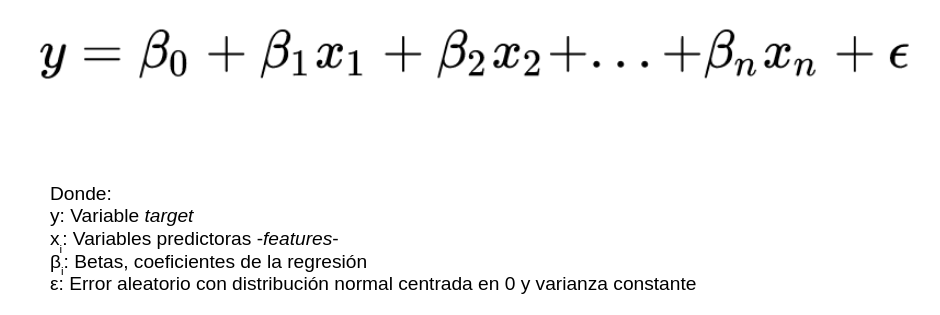

Debido a que este algoritmo es muy simple, la mayoría de las veces los implementadores no verifican que se cumplan los supuestos para **poder** ocupar este algoritmo.  

Para ocupar este algoritmo debemos verificar que los siguientes supuestos se cumplen:

1. Las variables que ocuparemos para predecir la variable *target* son numéricas
2. Las variables que ocuparemos para predecir la variable *target* tienen una relación lineal con esta
3. Los errores del modelo son aditivos y siguen una distribución normal centrada en 0 con varianza constante

De los 3 supuestos mencionados, 2 de ellos pueden ser validados antes de desarrollar un modelo de regresión lineal:

1. Las variables con las que realizaremos la predicción son variables numéricas
2. Las variables con las que realizaremos la predicción tienen una relación lineal con la variable *target*

#### Validación de supuestos

**Validación 1**

Esta validación consiste en verificar que las variables que ocuparemos para entrenar el modelo, también conocidas como *features* sean de tipo numérico.

En caso de no serlo, habrá que realizarles alguna transformación adecuada al concepto que representan.

Por ejemplo, si en tu conjunto de datos tienes el género de una persona, esta variable no es numérica, pero puedes transformarla a una con representación binaria asignando el valor 1 a cualquiera de los dos valores del género, y 0 al otro. En la tabla se muestra la variable *gender* con dos posibles valores: F y M, transformando esta variable a binaria cambiamos los valores de F a 1 y los de M a 0.

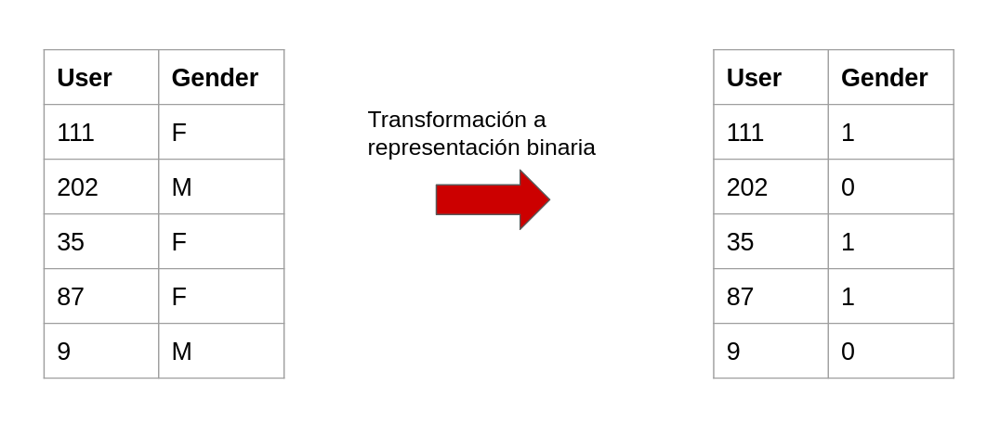

**One hot encoding**

Otra transformación que es muy común utilizar en ML es el *one hot encoding*.

Esta transformación permite cambiar una variable categórica a una representación binaria, para ello toma todos los posibles valores de la variable categórica y genera nuevas variables o columnas con esos valores, el contenido de estas nuevas variables será un 1 en caso de la presencia de esa variable y 0 en caso contrario.

Por ejemplo, en la tabla se muestra la columna `color` como una variable categórica que transformaremos a una representación numérica utilizando *one hot encoding*. Al aplicar *one hot encoding* generamos 4 nuevas columnas correspondientes a cada valor que puede tomar la variable categórica `color`.

En el caso del usuario 111, sabemos que el color que tenía asociado originalmente era `amarillo` y por lo tanto, en su representación de *one hot encoding*, es la única columna que tiene un 1, el resto debe ser 0. Nota que en este tipo de transformación únicamente una de las columnas nuevas puede tener un 1.

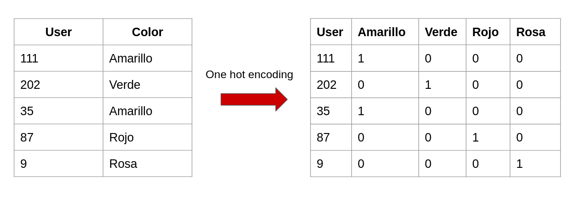

**Validación 2**

La segunda validación consiste en verificar que los  *features* que ocuparemos para predecir, tienen una relación lineal con la variable *target*.

La manera más sencilla de verificar esta suposición, consisten en graficar en un *scatterplot* entre el *feature* y la variable *target*.

Por ejemplo, en la imagen se muestra un conjunto de *scatterplots* entre 4 diferentes variables. En este conjunto de datos en particular, la variable *target* es `income`. La relación entre la variable `age` y la variable `income` parece ser lineal, conforme la edad aumenta, el ingreso aumenta.

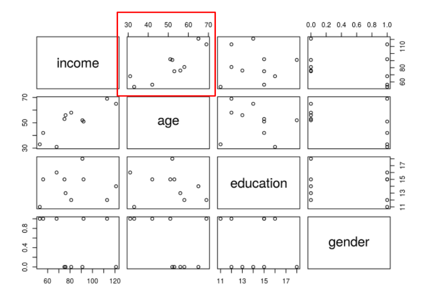

Ahora, verificaremos la relación entre la variable `education` y la variable *target*.

La relación entre ambas variables parece ser lineal, aunque no tan clara y definida como la de edad y el ingreso.   

Podemos suponer que la relación entre estas dos variables es lineal.

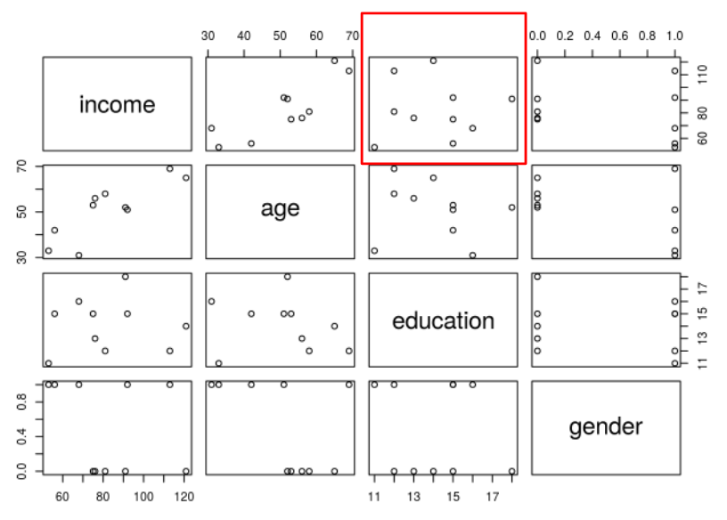

Por último verificaremos la relación entre la variable `gender` y la variable *target*.

Dado que la variable `gender` era una variable categórica que se transformó a una variable binaria, su visualización corresponde a 2 valores en el eje `x`, 0 y 1. Aún así, se puede identificar que para los valores en los que el valor de la variable `gender` es 0, la variable *target* tiene un un rango particular de valores.  Podemos suponer linealidad entre la variable `gender` y la variable *target*.

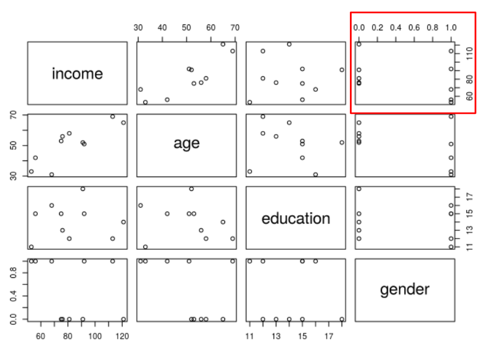

Si la relación entre una variable explicativa y la variable *target* no es lineal, podemos hacer transformaciones a la variable explicativa para que la relación se vuelva lineal.

Las transformaciones de este estilo más utilizadas son:

* Multiplicar la variable por una constante que le permita ser lineal
* Sacar el logaritmo de la variable predictiva
* Sacar la raíz cuadrada de la variable *target*

#### Algoritmo

En una regresión lineal, buscamos encontrar los valores de las betas por las cuales tenemos que multiplicar el valor de cada *feature* para predecir el valor de nuestra variable *target* $y$.

Existe una $\beta$ por cada *feature* que tengas en tu modelo, más una $\beta_0$ también llamada interceptor.

El valor de estas $\beta_i$ puede ser negativo o positivo.

El valor de la $\beta_0$ o interceptor, no se multiplica por ningún *feature*, y corresponde al valor asociado a la variable *target* cuando todos los *features* toman un valor de 0.

Por ejemplo, retomando las variables que tomamos como ejemplo para verificar linealidad entre los *features* y la variable *target*.

La variable *target* corresponde al *income*, es decir, queremos predecir el ingreso de una persona dada su edad, el nivel educativo y el género de la misma.

La regresión lineal encontrará los valores de las $\beta_i$ correspondientes a cada *feature* que al ser multiplicadas por el valor del *feature* y ser sumadas con el resto de las variables, darán el valor predicho para el ingreso.

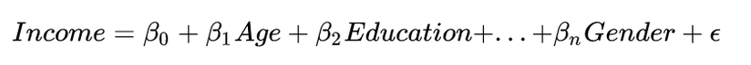

#### Interpretación

¿Cómo se interpretan estos coeficientes $\beta_i$ obtenidos por la regresión lineal?

Imagina que para el modelo de predicción de ingreso, el modelo de regresión lineal nos devuelve los siguientes valores para las $beta_i$:

+ -51.5408 como el valor del interceptor o $\beta_0$
+ 1.7841 como el valor de la $\beta_1$ correspondiente a la variable edad
+ 2.7086 como el valor de la $\beta_2$ correspondiente a la variable nivel educativo
+ 9.9207 como el valor de la $\beta_3$ correspondiente a la variable género

La $\beta_1$ de 1.7841, indica que por cada incremento en la variable edad, se espera un incremento en el ingreso de 1.7841

La $\beta_2$ de 2.7086, indica que por cada incremento en el nivel educativo se espera un increment en el ingreso 2.7086

La $\beta_3$ de 9.9207 indica que por cada incremento en el género se espera que un incremento en el ingreso de 9.9207. En esta variable en particular, dado que el género es binario no hay como tal incrementos o toma el valor 0 o toma el valor 1.

Por último, el interceptor es de -51.5408, esto significa que cuando la edad de un individuo es cero, su nivel educativo es cero y su género es cero, su ingreso es de -51.5408. Puede ser que el interceptor no tenga sentido si todos los demás valores son cero, esto sucede porque en el conjunto de entrenamiento no hubo observaciones en los que el valor de todas las variables fuera cero.

#### Evaluación de residuales

La última de las validaciones para ocupar regresión lineal, indica que los errores del modelo **deben** seguir una distribución normal centrada en 0 con varianza constante.

Para realizar la validación de esta suposición, ocuparemos los residuales del modelo, que corresponde a los errores del mismo.

**Residuales**

Los residuales del modelo corresponden a la diferencia entre los valores reales de la variable *target* y los valores predichos.

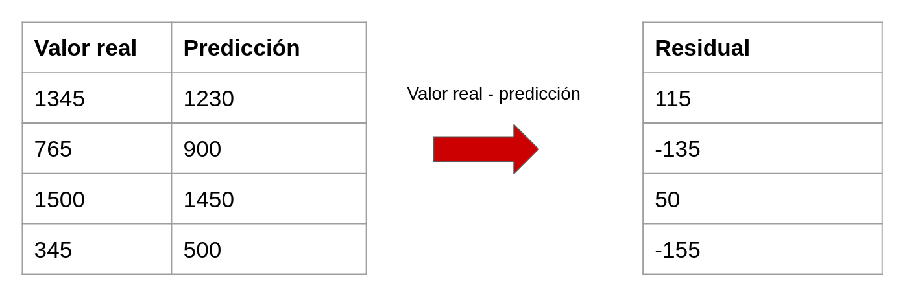

Habrá residuales mayores a 0, menores a cero y 0.

+ Los residuales mayores a 0 corresponden a las predicciones con subestimación.
+ Los residuales menores a cero corresponden a las predicciones con sobreestimación.
+ Los residuales en 0 corresponden a las predicciones con estimación exacta.

**Normalidad en los residuales**

Para verificar que los errores siguen una distribución normal, podemos ocupar una gráfica *scatterplot* especial llamada **Q-Q plot**, en la que ocupamos los cuartiles de una distribución normal teórica y los cuartiles de la distribución de los residuales. En este tipo de gráfica buscamos que se forme una línea de 45° y que la mayoría de las observaciones se encuentren en la línea, como se muestra en la imagen.

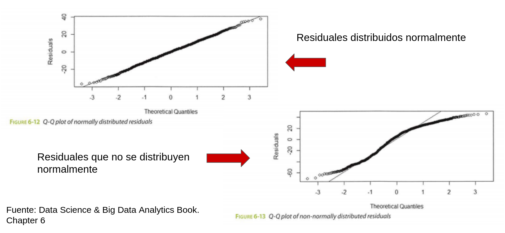
 

Esta es una manera muy sencilla de identificar gráficamente si los residuales siguen una distribución normal.

Por otro lado, si los residuales no siguieran una distribución normal, la gráfica de *Q-Q plot* (pronunciación: kiu kiu plot) se vería como la imagen de la derecha, observa que hay valores que se salen de la línea de 45°, lo que indica que los residuales no tienen una distribución normal.

**Varianza constante**

Por otro lado, falta cubrir que la varianza de los errores es constante.

Para verificar este supuesto deberemos generar un *scatterplot* entre los valores predichos por los modelos y los residuales. Los valores predichos por el modelo están en el eje `x`, y los residuales en el eje `y`.

En este *scatterplot*, esperamos ver las observaciones centradas en 0 sobre el eje `y`, y que las observaciones no sigan un patrón.

En la imagen se muestran los residuales de un modelo de regresión lineal centrados en 0 y sin algún patrón perceptible, parece que su varianza es constante.

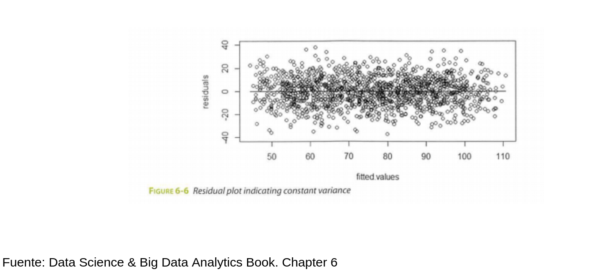
 

En las siguientes imágenes se puede ver que las gráficas de residuales no cumplen con el supuesto de estar centrados en 0 o bien tener una varianza constante.

En la imagen 1 puedes ver que los residuales no están centrados en 0 y además, siguen un patrón lineal, conforme el valor predicho aumenta, el valor del residual aumenta.

En la imagen 2 puedes ver que aunque los residuales están centrados en 0, la varianza no es constante entre todos los valores predichos por el modelo, hay menos error en valores predichos antes de 70 y mayor varianza entre los valores predichos mayores a 70.

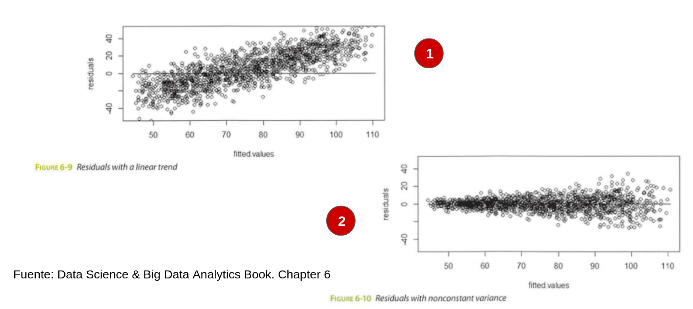
 

Por último, se muestran otros casos en los que los residuales no tienen varianza constante.

En la imagen 3 puedes ver que los residuales no están centrados en 0, y que además siguen un patrón no lineal.

En la imagen 4 puedes ver que los residuales aunque parecen tener una varianza constante entre todos los valores predichos por el modelo, no están centrados en 0.

Si un modelo de regresión lineal no cumple con **todos** los supuestos, no deberemos ocupar este algoritmo para realizar la predicción.

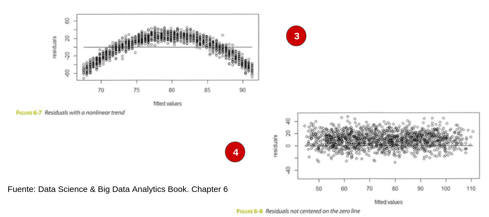
