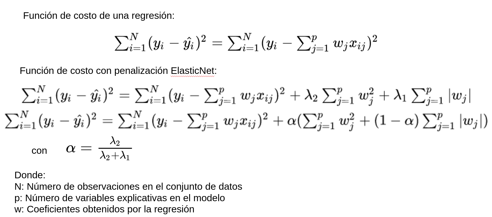

### Regularización

#### Agenda

+ Ridge
+ Lasso
+ ElasticNet

---

#### Introducción

Para evitar hacer *overfitting* en modelos de regresión lineal, existe una metodología específica conocida como Regularización, que consiste en "castigar" la complejidad de un modelo de regresión, es decir, aplicando regularización penalizaremos tener modelos más complejos que seguramente tienen mejor desempeño.

Un modelo de regresión se considera complejo en 2 situaciones, cuando agregamos muchos variables explicativas, o bien, cuando la magnitud de los coeficientes es muy grande.

Las 2 metodologías más comúnes de hacer generalización son Ridge y Lasso.

#### Ridge

El método de regularización de Ridge o también llamada regularización `l2`,  penaliza la complejidad del modelo basado en la magnitud de los coeficientes, para ello agrega a la función de costo de la regresión la penalización equivalente a elevar al cuadrado los coeficientes obtenidos por la regresión.

El coeficiente de penalización conocido como lambda, permite castigar valores grandes de coeficientes encogiéndolos para que no crezcan.

Un coeficiente lambda pequeño provocará que la penalización sea muy relajada y por lo tanto que los coeficientes crezcan. Por otro lado, un lambda alto provoca una estricta penalización de tener coeficientes altos por lo que provocará que éstos se encojan hasta tener un valor muy cercano a 0 pero nunca de 0.

Encontrar el valor adecuado de lambda depende del problema y de la experiencia del que desarrolla el modelo.

La manera en la que los autores de este método sugieren seleccionar el valor de lambda, es a través de una gráfica de trazabilidad de lambda en donde se grafican diferentes valores de lambda utilizados y el valor de los coeficientes obtenidos.

 
Fuente: [https://www.cvxpy.org/examples/machine_learning/ridge_regression.html](https://www.cvxpy.org/examples/machine_learning/ridge_regression.html)

En la imagen, cada línea representa el coeficiente asignado por una regresión a cada variable explicativa, y los diferentes valores que van tomando conforme se va modificando el valor de lambda. Se puede ver que cuando lambda tiene un valor muy bajo los coeficientes de cada variable prácticamente no se mueven, pero conforme el valor de lambda aumenta, los coeficientes se van encogiendo acercándose al valor de cero.

Se considera que los coeficientes que tardan más en encogerse indican las variables que más información aportan al modelo.

#### Lasso

Al igual que el método Ridge, la regularización del método Lasso o también llamada `l1`, penaliza la complejidad de un modelo de regresión con base a la magnitud de los coeficientes que genera.

Lo que cambia en este método de regularización es que en lugar de elevar al cuadrado el valor de los coeficientes, se obtiene el valor absoluto.

Al igual que con Ridge, Lasso penaliza coeficientes altos, sin embargo, en Lasso el valor de un coeficiente puede encogerse hasta llegar a ser 0. Esta es la razón principal por la que la regularización de Lasso se ocupa también para selección de variables en un modelo, pues aquellas variables cuyos coeficientes sean 0, no aportan información al modelo por lo que la regularización los elimina.

Al igual que con Ridge, un lambda pequeño implica que la regularización es muy laxa, no es está penalizando la complejidad, mientras que un lambda alto provoca ser estrictos con la magnitud de los coeficientes y eliminar aquellos que no aportan información al modelo.  

 
Fuente: [https://www.cvxpy.org/examples/machine_learning/lasso_regression.html](https://www.cvxpy.org/examples/machine_learning/lasso_regression.html)

**Desventajas**

+ Cuando la cantidad de observaciones $n$ es menor que el número de variables $p$ que contiene el conjunto de datos, Lasso selecciona a lo más $n$ variables de las posibles $p$.

+ Cuando las variables forman parte de un grupo, Lasso tenderá a solo seleccionar una variable del grupo, dejando fuera al resto de variables de ese grupo.

#### ElasticNet

ElasticNet integra tanto la penalización de Ridge como la de Lasso con una adecuación, por lo que agrega el parámetro `alpha` con el que ajusta las lambdas de la regularización de Lasso.

ElasticNet ocupa lo mejor de ambas regularizaciones y resuelve las desventajas de Lasso.

En esta regularización debido a que se integra la regularización de Lasso, también es posible tener coeficientes con valor de 0. De igual manera, una lambda pequeña provoca tener un modelo laxo en penalización, y una lambda grande penaliza coeficientes grandes.

 
Fuente: [https://github.com/ajmaurer/glmnet-python](https://github.com/ajmaurer/glmnet-python)

En la imagen cada línea representa el coeficiente de una variable del conjunto de datos, nuevamente, cuando lambda tiene valores pequeños los coeficientes no se penalizan, conforme lambda va aumentando su valor, los coeficientes se van encogiendo hacia el cero, con posibilidad de ser 0.

Al igual que con Lasso, ElasticNet permite hacer selección de variables de acuerdo a la información que aportan al modelo.

 Ir al notebook `regularizacion.ipynb`
